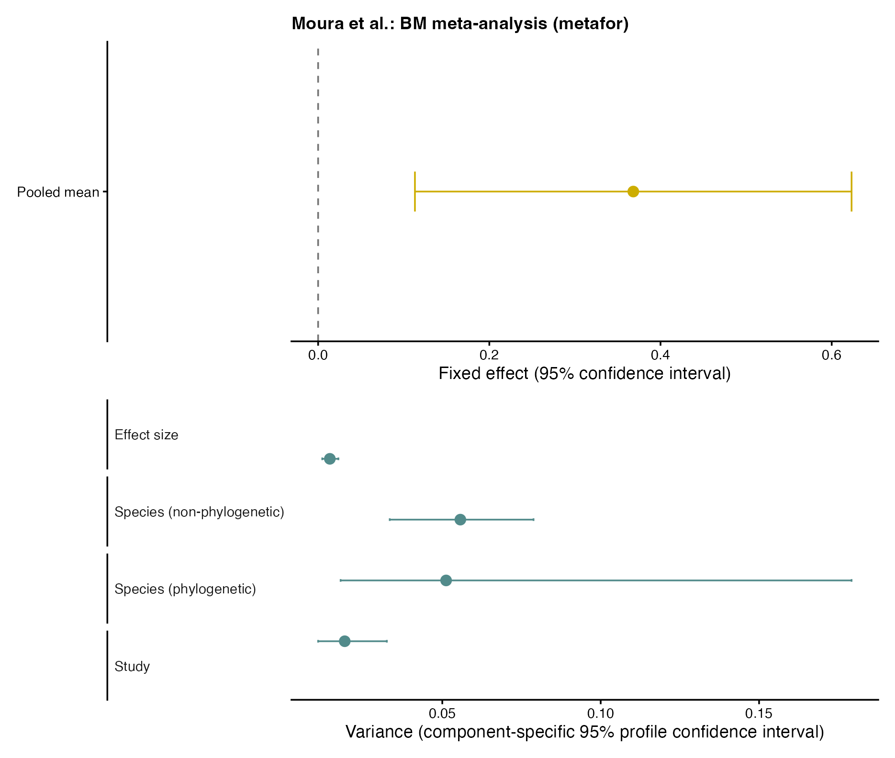
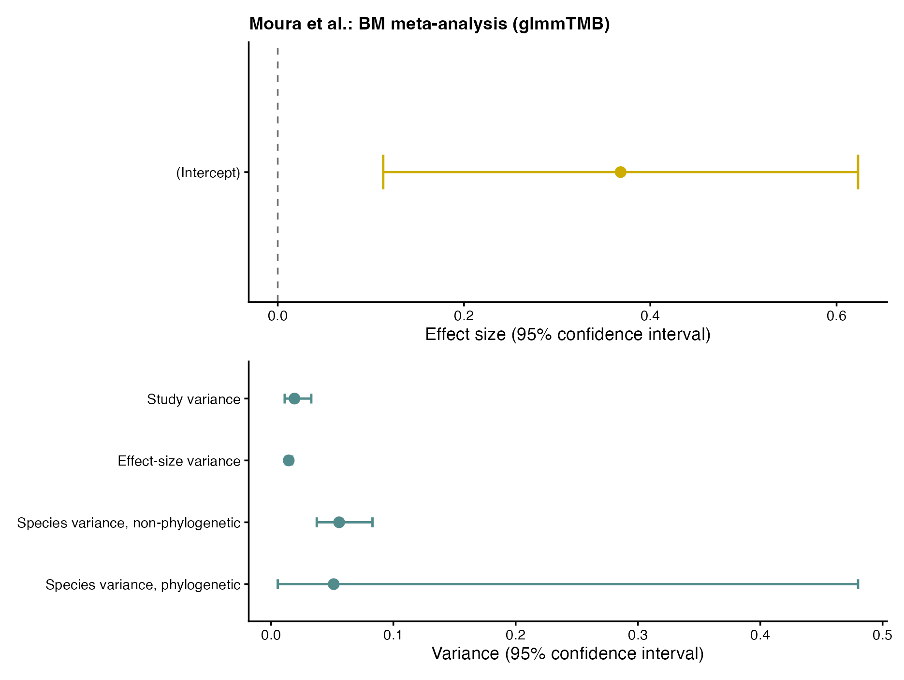
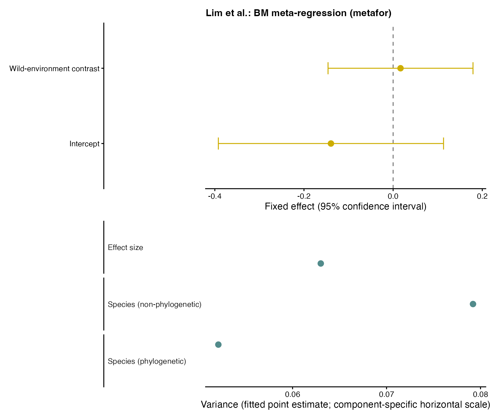
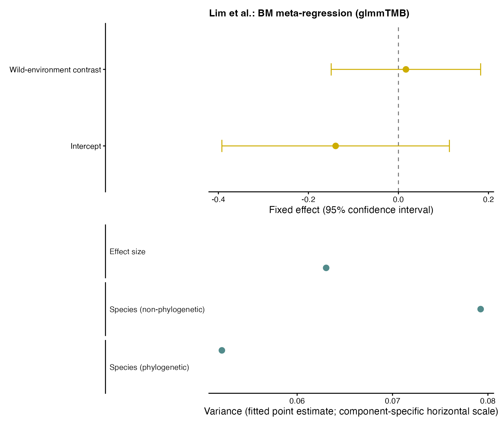

# Intended audience and scope

*This online tutorial accompanies our tutorial paper: A unified framework for phylogenetic and spatial meta-analysis: concepts, implementation, and practical guidance \[LINK\]*

This is intended for researchers who already have a basic understanding of meta-analysis and some familiarity with statistical modelling in `R`. It is aimed at readers who are interested in phylogenetic and spatial meta-analytic modelling, given the increasing availability of large-scale datasets that include species-level traits and geographic information.

In this online tutorial, we demonstrate how to conduct phylogenetic and spatial meta-analyses using R packages such as `metafor`, `brms`, and `glmmTMB`. We provide step-by-step instructions on creating phylogenetic and spatial correlation matrices, fitting models with different correlation structures, and interpreting the results.

# Setup

```{r}

# install.packages("pacman") # if not already installed
pacman::p_load(brms, metafor, metadat, tidyverse, crayon, here, ape, patchwork, dplyr, tidyr, MCMCglmm, bayesplot, tidybayes, posterior, orchaRd,purrr, stringr, readr, magrittr, janitor, glmmTMB, rotl, sf, gtools)
```

Set up parallel processing for `brms` - please adjust according to your computer's capabilities.

```{r}
#| eval: false

max_cores <- 10
num_chains <- 2
threads_per_chain <- floor(max_cores / num_chains)
options(mc.cores = num_chains) 

```

# Phylogenetic meta-analysis

## How to make phylogenetic correlation matrix?

First, we will show how to make a phylogenetic correlation matrix to account for the shared evolutionary history of species in your meta-analytic dataset. A phylogenetic correlation matrix reflects how closely related species are. Relations among a set of species (phylogenies) can be derived in two main ways:

1.  Using a specific phylogenetic tree
2.  Using the `rotl` package (accessing a synthetic tree from Open Tree of Life; <https://opentreeoflife.github.io/>)

In the following two sections, we introduce how to make the correlation matrix from phylogenetic trees in these two ways. When making a correlation matrix from a phylogenetic tree we need to assume an evolutionary model (process), which determines how branch lengths are transformed into expected covariances between species. The example below demonstrates how to compute a correlation matrix under the Brownian motion process. <!-- For the *Ornstein–Uhlenbeck process*, please refer to their respective sections.  -->

::: callout
**Note on tree preparation and cleaning/pruning**

The starting point usually is a list of species represented in your data set – ideally, it is a list of correct Latin binomial names, using the most recent and accepted taxonomic naming convention. Sometimes, the species names in your data may not match those in the tree you are using to create your phylogenetic correlation matrix. Data matching and cleaning are not covered in this tutorial - please ensure that naming is consistent and fully matched before creating the phylogenetic correlation matrix. There are some helper `R` packages for resolving mismatched taxonomic names among datasets and phylogenetic trees (reviewed in [Grenié et al. 2022](https://doi.org/10.1111/2041-210X.13802)). Meta-analytic models will not run if the lists of names in the data set and those in the correlation matrix do not match exactly.

Also, when subsetting a larger existing phylogenetic tree to match your list of species, it will be necessary to remove (drop) extra species from the tree that are not in your dataset (i.e. prune the tree). In that case, you can use `TreeTools::DropTip()` / `ape::drop.tip()` (or`TreeTools::KeepTip()` / `ape::keep.tip()`). You can see how to do this in the example below)
:::

:::: panel-tabset
### Using a specific phylogenetic tree {#using-a-specific-phylogenetic-tree}

In some cases, the phylogenetic relationships among the species of interest are already well established, and a corresponding phylogenetic tree for a given taxon is available from a published source or a public repository. When this is the case, it is usually preferable to use the existing tree rather than constructing a new one. For example, large, time-calibrated phylogenies are available for many taxonomic groups (e.g. birds, mammals, plants), often accompanied by branch lengths and documentation of the underlying assumptions. Using such trees ensures consistency with previous studies and avoids unnecessary reconstruction steps

We now illustrate how to use an existing phylogenetic tree provided as a file and prepare it for use in downstream analyses, such as phylogenetic meta-analysis (of course, you can also apply what we explain to broader phylogenetic comparative analysis.)

#### Step 1. Read the tree from a file

Phylogenetic trees are commonly distributed in formats such as Newick (`.nwk`, `.tre`) or Nexus (`.nex`). The `ape` package can read most of these standard-format files.

Here, we will use a sample dataset on *Sylviidae* (Sylviid warblers; a family of passerines). We have a Nexus file containing a phylogenetic tree for 294 species from the Sylvidae family. However, our meta-analytic dataset only includes 10 species (for didactic purposes). So, we first need to "prune" the tree to remove those species that are not in our data set.

```{r}
#| label: way 1 - phylometa
#| eval: false

library(ape)

#load ape library for reading and manipulating phylogenetic trees in R

dat <- read.csv(here("data", "Sylviidae_dat.csv"))
dat$Phylo 
#  [1] "Abroscopus_albogularis"      "Abroscopus_schisticeps"     
#  [3] "Abroscopus_superciliaris"    "Achaetops_pycnopygius"      
#  [5] "Acrocephalus_aedon"          "Acrocephalus_aequinoctialis"
#  [7] "Acrocephalus_agricola"       "Acrocephalus_arundinaceus"  
#  [9] "Acrocephalus_atyphus"        "Acrocephalus_australis"     

# Load phylogenetic tree – note that this file contains multiple alternative trees
trees <- read.nexus(here("data", "Sylviidae.nex"))

# select the first tree from a list of many alternative trees for Sylviidae
tree <- trees[[1]]

#plot(tree) #you can try to plot the tree, but its going to be quite big!

```

#### Step 2. Basic structural checks

Before using the tree in analyses, it is good practice to perform some basic checks to ensure that the tree structure is appropriate for the intended analysis (i.e. in this case, is the tree ultrametric and binary – see below).

```{r}
#| eval: false

# Check whether the tree is ultrametric (time-calibrated)
is.ultrametric(tree)
# [1] TRUE

# Check whether the tree is fully bifurcating
is.binary(tree)
# [1] TRUE
```

#### Step 3. Match tree tip labels to the dataset

The species names in the tree (tip labels) must match exactly the species names used in the dataset.

```{r}
#| eval: false

# species names used in the dataset
species_data <- unique(dat$Phylo)

length(tree$tip.label) # number if species names on the tree tips
# [1] 294
length(species_data) # number of species names in the dataset
# [1] 10

# check for mismatches between tree tip labels and dataset species names
setdiff(species_data, tree$tip.label) # species names from the dataset not found in the tree
setdiff(tree$tip.label, species_data) # species names from the tree not found in the dataset

```

Given that we only have 10 species in the dataset and 294 species in the tree, most species from tree will not be present in the dataset. At this point, it is also very important to look at the other mismatch result, which checks whether all of the species in our dataset can be matched to the tree. If mismatches occur, we need to consider whether it is a truly missing species, typographical errors, outdated taxonomy, hybrid species which do not fit on binomial tree, or differences in naming conventions (e.g. using underscores vs spaces between name segments, or using subspecies names). These issues must be resolved manually before proceeding. In our example, we have a dataset with species names that match the tree, si we do not need to deal with such issues.

#### Step 4. Prune the tree to include only species in the dataset

Phylogenetic trees often contain more species than required for a given analysis (as in our example above). Extraneous tips should be removed to match the dataset.

```{r}
#| eval: false

tree_pruned  <- drop.tip(tree,setdiff(tree$tip.label, species_data))

length(tree_pruned$tip.label) # check how many species left on the pruned tree
plot(tree_pruned) # check the pruned tree

```

```{r}
#| echo: false

dat <- read.csv(here("data", "Sylviidae_dat.csv"))
#  [1] "Abroscopus_albogularis"      "Abroscopus_schisticeps"     
#  [3] "Abroscopus_superciliaris"    "Achaetops_pycnopygius"      
#  [5] "Acrocephalus_aedon"          "Acrocephalus_aequinoctialis"
#  [7] "Acrocephalus_agricola"       "Acrocephalus_arundinaceus"  
#  [9] "Acrocephalus_atyphus"        "Acrocephalus_australis"     

# If the file contains multiple trees, select a single representative tree
trees <- read.nexus(here("data", "Sylviidae.nex"))

tree <- trees[[1]]  
# species names used in the dataset
species_data <- unique(dat$Phylo)


tree_pruned  <- drop.tip(tree, setdiff(tree$tip.label, species_data))

plot(tree_pruned) 
```

```{r}
#| eval: false

# check the binary and ultrametric status again
is.binary(tree_pruned)
# [1] TRUE

is.ultrametric(tree_pruned)
# [1] TRUE
```

#### Step 5. Compute the phylogenetic correlation matrix

Once the tree is time-calibrated (= ultrametric), fully bifurcating (= binary), and pruned to match the dataset, you can compute the phylogenetic correlation matrix under a Brownian motion model using the `vcv()` function from the `ape` package.

```{r}
#| eval: false

A <-  vcv(tree_pruned, corr = TRUE)
# check the dimensions and preview the top-left block
dim(A)       

```

This matrix represents the expected pirwise correlation among species due to shared evolutionary history and can be used directly in phylogenetic comparative or meta-analytic models.

### Using the `rotl` package (Open Tree of Life) {#using-the-rotl-package-open-tree-of-life}

In practice, you will not always have a phylogenetic tree readily available for the species in your dataset. In such cases, the `rotl` package can be used to access the Open Tree of Life and retrieve a tree based on the *Latin* species names in your dataset.

::: callout-note
-   Make sure that the species names in your dataset are in Latin (scientific names) and are spelled correctly. The `rotl` package relies on these names to find the corresponding species in the Open Tree of Life (https://opentreeoflife.github.io/use).
-   The OpenTree synthetic tree and name resolution services are actively updated. Running the same code at different times may yield slightly different trees due to updates in the database.
-   For reproducible research, it is good practice to save the retrieved tree to a file (e.g., in Newick or Nexus format) after obtaining it using `rotl`. This way, you can ensure that you are using the same tree in future analyses.
-   Automated name matching is convenient but may not always be perfect. It is advisable to manually check the matched names to ensure accuracy.
:::

```{r}
#| eval: false

# install and load necessary packages - if not already installed
# install.packages("rotl")
# install.packages("ape")

library(rotl)
library(ape)

# record info about OpenTree version
tol_about()
# OpenTree Synthetic Tree of Life.

# Tree version: opentree16.1
# Taxonomy version: 3.7draft3
# Constructed on: 2025-12-20 00:55:58
# Number of terminal taxa: 2385875
# Number of source trees: 2064
# Number of source studies: 1931
# Source list present: false
# Root taxon: cellular organisms
# Root ott_id: 93302
# Root node_id: ott93302
```

#### Step 1. Provide a species list

Here, we use 10 commonly used lab model taxa across different animal groups as an example. Use Latin names, not common names.

```{r}
#| eval: false

# make species list
myspecies <- c(
  "Escherichia colli",                # typo on purpose
  "Chlamydomonas reinhardtii",
  "Drosophila melanogaster",
  "Arabidopsis thaliana",
  "Rattus norvegicus",
  "Mus musculus",
  "Cavia porcellus",
  "Xenopus laevis",
  "Saccharomyces cervisae",           # typo on purpose
  "Danio rerio"
)
```

#### Step 2. Resolve species names using OpenTree TNRS

We start with strict matching to identify exact matches and flag names that may require manual attention. We then use approximate matching only as a diagnostic step for unresolved names, because fuzzy matches can help detect likely typos or synonyms but should always be checked before being accepted.

```{r}
#| eval: false

# strict matching first:
taxa_strict <- tnrs_match_names(
  names = myspecies, 
  do_approximate_matching = FALSE # set FALSE
  )
#   Warning message:
# Escherichia colli, Saccharomyces cervisae are not matched 

taxa_strict
#                search_string               unique_name approximate_match score
# 1          escherichia colli                      <NA>                NA    NA
# 2  chlamydomonas reinhardtii Chlamydomonas reinhardtii             FALSE     1
# 3    drosophila melanogaster   Drosophila melanogaster             FALSE     1
# 4       arabidopsis thaliana      Arabidopsis thaliana             FALSE     1
# 5          rattus norvegicus         Rattus norvegicus             FALSE     1
# 6               mus musculus              Mus musculus             FALSE     1
# 7            cavia porcellus           Cavia porcellus             FALSE     1
# 8             xenopus laevis            Xenopus laevis             FALSE     1
# 9     saccharomyces cervisae                      <NA>                NA    NA
# 10               danio rerio               Danio rerio             FALSE     1
#     ott_id is_synonym flags number_matches
# 1       NA         NA  <NA>             NA
# 2    33153      FALSE                    1
# 3   505714      FALSE                    1
# 4   309263      FALSE                    1
# 5   271555      FALSE                    1
# 6   542509      FALSE                    1
# 7   744000      FALSE                    1
# 8   465096      FALSE                    1
# 9       NA         NA  <NA>             NA
# 10 1005914      FALSE                    1


# fuzzy matching for unresolved names:
taxa <- tnrs_match_names(
  names = myspecies,
  do_approximate_matching = TRUE # set TRUE
)

taxa
#                search_string               unique_name approximate_match
# 1          escherichia colli          Escherichia coli              TRUE
# 2  chlamydomonas reinhardtii Chlamydomonas reinhardtii             FALSE
# 3    drosophila melanogaster   Drosophila melanogaster             FALSE
# 4       arabidopsis thaliana      Arabidopsis thaliana             FALSE
# 5          rattus norvegicus         Rattus norvegicus             FALSE
# 6               mus musculus              Mus musculus             FALSE
# 7            cavia porcellus           Cavia porcellus             FALSE
# 8             xenopus laevis            Xenopus laevis             FALSE
# 9     saccharomyces cervisae  Saccharomyces cerevisiae              TRUE
# 10               danio rerio               Danio rerio             FALSE
#        score  ott_id is_synonym          flags number_matches
# 1  0.9375000  474506      FALSE sibling_higher              2
# 2  1.0000000   33153      FALSE                             1
# 3  1.0000000  505714      FALSE                             1
# 4  1.0000000  309263      FALSE                             1
# 5  1.0000000  271555      FALSE                             1
# 6  1.0000000  542509      FALSE                             1
# 7  1.0000000  744000      FALSE                             1
# 8  1.0000000  465096      FALSE                             1
# 9  0.9166667  356221      FALSE                             2
# 10 1.0000000 1005914      FALSE                             1
```

In this example, the strict match flags two misspelled names, and approximate matching helps identify their likely intended taxa. In practice, once these likely matches have been identified, it is better to correct the original species names and rerun strict matching than to proceed with fuzzy matches in the final workflow.

If the strict match fails or returns `NAs`, you can enable approximate matching. Approximate matching uses fuzzy string matching to find the closest matches in the OpenTree taxonomy, but you should always inspect the returned matches carefully.

Key columns to check include

-   `unique_name`: the matched OpenTree taxon name
-   `ott_id`: the OpenTree taxonomy identifier used for tree retrieval
-   `approximate_match`: `TRUE` indicates a non-exact match, for example due to a typo
-   `is_synonym`: `TRUE` indicates the input name was treated as a synonym

A useful rule of thumb is as follows:

-   if `approximate_match == TRUE` and the reason is an obvious typo, correct the original species list and rerun the name matching. This ensures that the final dataset contains clean and unambiguous names.
-   If a match looks suspicious, for example because the matched taxon belongs to a different genus or the name could plausibly refer to multiple taxa, do not accept the match blindly. Instead, inspect the additional information returned by `tnrs_match_names()` to confirm that the matched taxon is indeed the one you intended to include.

#### Step 3. Fix typos and re-run matching

```{r}
#| eval: false

myspecies_fixed <- c(
          "Escherichia coli",
          "Chlamydomonas reinhardtii",
          "Drosophila melanogaster",
          "Arabidopsis thaliana",
          "Rattus norvegicus",
          "Mus musculus",
          "Cavia porcellus",
          "Xenopus laevis",
          "Saccharomyces cerevisiae",
          "Danio rerio"
           )
  
taxa_fixed <- tnrs_match_names(
                    names = myspecies_fixed,
                    do_approximate_matching = FALSE
                     )

# taxa_fixed
#                search_string               unique_name approximate_match score
# 1           escherichia coli          Escherichia coli             FALSE     1
# 2  chlamydomonas reinhardtii Chlamydomonas reinhardtii             FALSE     1
# 3    drosophila melanogaster   Drosophila melanogaster             FALSE     1
# 4       arabidopsis thaliana      Arabidopsis thaliana             FALSE     1
# 5          rattus norvegicus         Rattus norvegicus             FALSE     1
# 6               mus musculus              Mus musculus             FALSE     1
# 7            cavia porcellus           Cavia porcellus             FALSE     1
# 8             xenopus laevis            Xenopus laevis             FALSE     1
# 9   saccharomyces cerevisiae  Saccharomyces cerevisiae             FALSE     1
# 10               danio rerio               Danio rerio             FALSE     1
#     ott_id is_synonym          flags number_matches
# 1   474506      FALSE sibling_higher              1
# 2    33153      FALSE                             1
# 3   505714      FALSE                             1
# 4   309263      FALSE                             1
# 5   271555      FALSE                             1
# 6   542509      FALSE                             1
# 7   744000      FALSE                             1
# 8   465096      FALSE                             1
# 9   356221      FALSE                             1
# 10 1005914      FALSE                             1
```

At this point, you should confirm that: - All species have a valid `ott_id`. - the returned matches correspond to the intended taxa.

#### Step 4. Retrieve the phylogenetic tree from OpenTree

Once you are satisfied with the matched OpenTree identifiers, you can request a trimmed subtree from the OpenTree synthetic tree using `tol_induced_subtree()`. At this stage, the OpenTree subtree provides a convenient phylogenetic topology for the matched taxa. However, before using it in comparative or meta-analytic models, you should still check whether the tip labels are appropriate, whether branch lengths are available, and whether the tree satisfies assumptions such as bifurcation and ultrametricity.

```{r}
#| eval: false

tree <- tol_induced_subtree(
            ott_ids = taxa_fixed[["ott_id"]],
            label_format = "name"
            ) 
# returns a trimmed subtree as an ape::phylo object
# warnings about collapsing single nodes are common and usually not problematic here
```

```{r}
#| echo: false

myspecies_fixed <- c(
            "Escherichia coli",
            "Chlamydomonas reinhardtii",
            "Drosophila melanogaster",
            "Arabidopsis thaliana",
            "Rattus norvegicus",
            "Mus musculus",
            "Cavia porcellus",
            "Xenopus laevis",
            "Saccharomyces cerevisiae",
            "Danio rerio"
          )

taxa_fixed <- tnrs_match_names(
                names = myspecies_fixed,
                do_approximate_matching = FALSE
                )

tree <- tol_induced_subtree(
          ott_ids = taxa_fixed[["ott_id"]],
          label_format = "name") 

# plot the retrieved subtree for quick inspection
plot(tree, cex=.8, label.offset =.1, no.margin = TRUE)

```

#### Step 5. Clean and standardise tip labels

The tip labels returned by OpenTree are not always directly ready for downstream analyses. They may contain underscores, appended identifiers, or labels corresponding to internal nodes rather than named terminal taxa. The goal of this step is therefore to standardise the labels for readability and to check that each tip can be matched unambiguously to the intended species in the dataset.

In our example, one tip is labelled `"mrcaott616ott617"` rather than *Escherichia coli*. This is a non-taxon internal node within Bacteria, which can arise when only one representative from a large clade is included. Since there are no other bacteria in the dataset and the tree position is appropriate for our purposes, we relabel this tip as *Escherichia coli* for didactic purposes.

```{r}
#| eval: false

tree$tip.label # see the current tree tip labels
#  [1] "Arabidopsis_thaliana"      "Chlamydomonas_reinhardtii"
#  [3] "Mus_musculus"              "Rattus_norvegicus"        
#  [5] "Cavia_porcellus"           "Xenopus_laevis"           
#  [7] "Danio_rerio"               "Drosophila_melanogaster"  
#  [9] "Saccharomyces_cerevisiae"  "mrcaott616ott617"   

# replace underscores with spaces for readability
tree$tip.label <- gsub("_", " ", tree$tip.label)

# inspect the lineage of the E. coli OTT identifier
ecoli <- tol_node_info(ott_id = 474506, include_lineage = TRUE)
tax_lineage(ecoli) # domain within Bacteria
#      rank               name        unique_name ott_id
# 1  domain           Bacteria           Bacteria 844192
# 2 no rank cellular organisms cellular organisms  93302

# we can see what info is available for this genus - not much, looks like a messy bit of a tree flagged as "INCONSISTENT"
# tnrs_match_names(names = ("Escherichia")) 

# relabel the MRCA-like tip for plotting and matching
tree$tip.label <- gsub("mrcaott616ott617", "Escherichia coli", tree$tip.label)

```

We can now plot the cleaned tree for inspection. Note that branch lengths are not yet included, so at this stage the tree is mainly useful for checking topology and tip labels.

```{r}
#| echo: false

tree$tip.label <- gsub("_", " ", tree$tip.label)

# # Relabel MRCA-like tips for didactic plotting purposes
# ecoli <- tol_node_info(ott_id = 474506, include_lineage = TRUE)
# tax_lineage(ecoli) # domain within Bacteria
# tnrs_match_names(names = ("Escherichia")) 

tree$tip.label <- gsub("mrcaott616ott617", "Escherichia coli", tree$tip.label) 
plot(tree, cex=.8, label.offset =.1, no.margin = TRUE) 

```

#### Step 6. Final checks (binary tree and matching tip labels)

Before using the tree in downstream analyses, it is good practice to confirm that:

-   The tree is fully binary, if that is required for your method.
-   The tip labels match exactly the species list in your dataset.

```{r}
#| eval: false

# check whether the tree is binary
is.binary(tree) # should return TRUE
# [1] TRUE

# check exact matching between the species list and tree tip labels
intersect(as.character(tree$tip.label), myspecies_fixed)
#  [1] "Arabidopsis thaliana"      "Chlamydomonas reinhardtii"
#  [3] "Mus musculus"              "Rattus norvegicus"        
#  [5] "Cavia porcellus"           "Xenopus laevis"           
#  [7] "Danio rerio"               "Drosophila melanogaster"  
#  [9] "Saccharomyces cerevisiae"  "Escherichia coli"  

setdiff(myspecies_fixed, as.character(tree$tip.label))
# character(0)
setdiff(as.character(tree$tip.label), myspecies_fixed)
# character(0)

```

#### Step 7. Compute the phylogenetic correlation matrix (handling missing branch lengths)

At this point, the tree topology may be usable for plotting or simple inspection, but it is not yet guaranteed to be suitable for phylogenetic covariance calculations. In particular, `vcv()` requires branch lengths, and many comparative models additionally assume a fully bifurcating and often ultrametric tree. The Open Tree of Life synthetic tree often provides a well-resolved topology, but it does not always include branch lengths.

To compute a phylogenetic variance-covariance (VCV) or correlation matrix under a Brownian motion (BM) process, we use `vcv()` from the `ape` package. If the tree has no branch lengths, `vcv()` will fail with:

```{r}
#| eval: false

A <- vcv(tree, corr = TRUE)
# Error in vcv.phylo(tree, corr = TRUE) : the tree has no branch lengths
```

For didactic purposes in this tutorial, we assign equal branch lengths to all edges (that is, all branch lengths are set to 1). This allows us to demonstrate the workflow and obtain a valid correlation matrix. In real analyses, you should consider using a tree with biologically meaningful branch lengths (for example, a time-calibrated phylogeny).

```{r}
#| eval: false

# check whether the OpenTree synthetic tree includes branch lengths
is.null(tree$edge.length)
# [1] TRUE # TRUE indicates that branch lengths are missing

# if branch lengths are missing, add equal branch lengths for didactic purposes
if (is.null(tree$edge.length)) {
  tree$edge.length <- rep(1, nrow(tree$edge))
    }

# compute the phylogenetic correlation matrix under Brownian motion
A <- vcv(tree, corr = TRUE)

# check the dimensions and preview the top-left block
dim(A)        # should return the number of species (rows/columns)
# [1] 10 10

A[1:5, 1:5]
#                           Arabidopsis_thaliana Chlamydomonas_reinhardtii
# Arabidopsis_thaliana                 1.0000000                 0.6666667
# Chlamydomonas_reinhardtii            0.6666667                 1.0000000
# Mus_musculus                         0.2041241                 0.2041241
# Rattus_norvegicus                    0.2041241                 0.2041241
# Cavia_porcellus                      0.2182179                 0.2182179
#                           Mus_musculus Rattus_norvegicus Cavia_porcellus
# Arabidopsis_thaliana         0.2041241         0.2041241       0.2182179
# Chlamydomonas_reinhardtii    0.2041241         0.2041241       0.2182179
# Mus_musculus                 1.0000000         0.8750000       0.8017837
# Rattus_norvegicus            0.8750000         1.0000000       0.8017837
# Cavia_porcellus              0.8017837         0.8017837       1.0000000
```

### What if there are polytomies or non-ultrametric trees?

The subtree returned by OpenTree may be sufficient for demonstration purposes, but many phylogenetic models require additional assumptions about branching structure and branch lengths. We therefore illustrate how to diagnose and handle two common issues: *polytomies* and *non-ultrametric* trees.

A polytomy occurs when an internal node has more than two descendant branches (a multifurcation).

A non-ultrametric tree is a tree in which not all tips are equidistant from the root, meaning that the tree is not time-calibrated.

Many phylogenetic comparative and meta-analytic models assume a fully bifurcating and ultrametric tree, because the expected covariance among species is defined under a continuous-time branching process (for example Brownian motion or Ornstein–Uhlenbeck evolution). Here we illustrate what these issues mean, and how they can be handled, using a simple toy example.

#### Create a toy tree with a polytomy

```{r}

library(ape)
library(phytools)

# A simple tree with one polytomy (A, B, C diverge simultaneously)
tree_poly <- read.tree(text = "((A,B,C),D,E);")
plot(tree_poly)
```

```{r}
#| eval: FALSE

is.binary(tree_poly)
# [1] FALSE

```

Here, species A, B, and C form a polytomy because their common ancestor has three descendants instead of two…

Under a Brownian motion or OU model, the phylogenetic covariance matrix is derived from branch lengths along a fully specified bifurcating tree.\
When a node is a polytomy, the relative order of divergence among its descendants is undefined, which means that their shared evolutionary history cannot be uniquely translated into a covariance structure.

#### Resolving polytomies

`multi2di()` resolves a polytomy by inserting very short branches, creating an arbitrary but fully bifurcating tree. This corresponds to assuming that the true branching order is unknown but occurred over a very short evolutionary time.

```{r}

set.seed(1)

tree_bin <- multi2di(tree_poly, random = TRUE)

```

```{r}
#| eval: FALSE

is.binary(tree_bin)
# [1] TRUE

```

```{r}

tree_bin <- multi2di(tree_poly, random = TRUE)
plot(tree_bin)
```

Because the resolution is random, different runs of `multi2di()` will yield different bifurcating trees. If you want reproducible results, set a random seed before calling `multi2di()`.

```{r}

set.seed(15)
tree_bin1 <- multi2di(tree_poly, random = TRUE)
set.seed(50)
tree_bin2 <- multi2di(tree_poly, random = TRUE)

```

```{r}
#| echo: FALSE

par(mfrow = c(1,2))
plot(tree_bin1); title("Tree 1")
plot(tree_bin2); title("Tree 2")

par(mfrow = c(1,1))
```

#### Create a non-ultrametric toy tree

```{r}
#| eval: FALSE

tree_nonultra <- read.tree(text = "((A:2,B:2):3,(C:1,D:4):2,E:5);")
is.ultrametric(tree_nonultra)
# [1] FALSE

```

```{r}
#| echo: FALSE

tree_nonultra <- read.tree(text = "((A:2,B:2):3,(C:1,D:4):2,E:5);")
plot(tree_nonultra)

```

As you can see, the tips do not all end at the same distance from the root, so the tree is not ultrametric. This means that branch lengths cannot be interpreted directly as shared evolutionary time, which is required for Brownian motion or Ornstein–Uhlenbeck based phylogenetic covariance models.

`chronos()` estimates branch lengths under a relaxed molecular clock, producing a tree in which all tips represent the same present time.\
This is required when phylogenetic covariance is interpreted as shared evolutionary time.

```{r}

tree_ultra1 <- chronos(tree_nonultra)

```

```{r}
#| eval: FALSE

is.ultrametric(tree_ultra1)
# [1] TRUE

```

```{r}
#| echo: FALSE

tree_ultra1 <- chronos(tree_nonultra)
plot(tree_ultra1)
```

Or, you can use `force.ultrametric()` from the `phytools` package to coerce a tree into an ultrametric form by extending branch lengths.

```{r}
#| eval: FALSE

tree_ultra2 <- force.ultrametric(tree_nonultra, method = "extend")
is.ultrametric(tree_ultra2)

```

```{r}
#| echo: FALSE

tree_ultra2 <- force.ultrametric(tree_nonultra, method = "extend")
plot(tree_ultra2)

```

In practice, the typical workflow is:

1.  Check whether the tree is binary and ultrametric.
2.  If polytomies are present, resolve them using `multi2di()`, ideally multiple times.
3.  If the tree is not ultrametric, apply a dating method such as `chronos()` or use a time-calibrated tree from the literature.
4.  Only then compute the phylogenetic covariance or correlation matrix using `vcv()`.

This ensures that the phylogenetic random effect used in meta-analysis corresponds to a well-defined evolutionary model.
::::

## Examples from real meta-analyses

### 1. Moura et al. (2021)

Here we use the dataset from [Moura et al. (2021)](https://doi.org/10.1111/ele.13690), which collated 1,828 effect sizes from 457 studies and 341 animal species to investigate assortative mating patterns. Each effect size is a Fisher's Z transformed correlation coefficient for body size correlations paired couples for within a single population and sampling period; each correlation is species-specific, and there are multiple correlations per species. The effect size indicates how strongly mates resemble each other in body size across a very broad taxonomic and ecological range. The dataset and phylogenetic tree are available in the `metadat` package as [`dat.moura2021`](https://wviechtb.github.io/metadat/reference/dat.moura2021.html).

Before fitting hierarchical meta-analytic models, it is important to assess whether key categorical predictor variables have sufficient replication to support the estimation of random effects (or fixed effects). In particular, the identifiability of variance components depends on having an adequate number of levels for each random factor, as well as repeated observations within those levels.

So, we begin by summarising the number of unique levels for all categorical variables in the dataset, with particular attention to variables commonly used as random effects in meta-analysis, such as study identity, species identity, and effect-size identity.

```{r}
#| eval: false

# read data from metadat package
dat_moura2021 <- dat.moura2021$dat

# duplicate the column with species name - additional column is needed for adding phylogenetic correlation matrix and non-phylogenetic random effect separately.
dat_moura2021$species.id.phy <- dat_moura2021$species.id

# add a column to be used as an ID of effect sizes to specify random errors in the meta-analytic model
dat_moura2021$effect.size.id <- 1:nrow(dat_moura2021)

# convert ID of effect sizes to a factor (categorical) variable
dat_moura2021$effect.size.id <- as.factor(dat_moura2021$effect.size.id)

## check data structure
cat_vars <- dat_moura2021 |>
  dplyr::select(where( ~ is.factor(.x) || is.character(.x)))

n_levels <- cat_vars |> 
  dplyr::summarise(across(
    everything(),
    ~ dplyr::n_distinct(.x)
  )) |> 
  tidyr::pivot_longer(
    cols = everything(),
    names_to = "variable",
    values_to = "n_levels"
  )

n_levels # shows how many levels each categorical variable has
# # A tibble: 13 × 2
#    variable          n_levels
#    <chr>                <int>
#  1 study.id               457
#  2 effect.size.id        1828
#  3 species                345
#  4 species.id             341
#  5 subphylum               11
#  6 phylum                   3
#  7 assortment.trait       233
#  8 trait.dimensions         5
#  9 field.collection         2
# 10 pooled.data              2
# 11 spatially.pooled         2
# 12 temporally.pooled        2
# 13 species.id.phy         341

```

The dataset contains 1,828 effect sizes (`effect.size.id`) drawn from 457 independent studies (`study.id`) and 341 animal species (`species.id.phy`). This provides replication at both the study and species levels, which is generally important for estimating random-effects variance components. There is, however, no universal rule for what constitutes sufficient replication, because this depends on the number of levels, the distribution of observations across levels, and the magnitudes of the variance components. As a general guide, variance components are more likely to be estimable when each random effect has multiple levels and when at least some levels contribute repeated observations. In the present dataset, the relatively large number of species particularly supports the inclusion of species-level random effects, including both non-phylogenetic (`species.id`) and phylogenetic (`species.id.phy`) terms.

Let's move on to compute the phylogenetic correlation matrix. A matching tree is supplied as a data object in the `metadat` package, so we just load it and can compute the matrix without additional checking and processing

```{r}
#| eval: false

# read tree from metadat package
tree <- dat.moura2021$tree

# calculate r-to-z transformed correlations and corresponding sampling variances
dat_moura2021 <- escalc(measure = "ZCOR", ri = ri, ni = ni, data = dat_moura2021)

# turn tree into an ultrametric onevusing the default "Grafen" method (Grafen 1989)
tree <- compute.brlen(tree)

# compute phylogenetic correlation matrix
A <- vcv(tree, corr = TRUE)

# check ultrametricity
is.ultrametric(tree)

```

#### Brownian motion (meta-analysis)

The Brownian Motion (BM) model assumes that traits evolve according to a random walk process along the branches of the phylogenetic tree. BM is default model for continuous trait evolution in comparative methods. In the model, the expected variance-covariance structure among species is directly proportional to their shared evolutionary history, as represented by the phylogenetic tree.

::: panel-tabset
###### metafor

```{r}
#| echo: false

# phylo_eg1_meta_ma_BM <- readRDS(here("Rdata", "tutorial_v2", "phylo_eg1_meta_BM.rds"))

```

```{r}
#| eval: false

phylo_eg1_meta_ma_BM <- rma.mv(yi, vi,
                 random = list(
                     ~ 1 | study.id, # among-study variation 
                     ~ 1 | effect.size.id,　# additional effect-size-level variation
                     ~ 1 | species.id, # species-specific, non-phylogenetic variation
                     ~ 1 | species.id.phy), # species-specific, phylogenetic variation
                     R = list(species.id.phy = A), # Brownian motion phylogenetic correlation matrix
                 data = dat_moura2021,
                 verbose = TRUE,
                 sparse = TRUE,
                 method = "REML"
                       )

summary(phylo_eg1_meta_ma_BM)
# Multivariate Meta-Analysis Model (k = 1828; method: REML)
# 
#    logLik   Deviance        AIC        BIC       AICc   
# -167.6726   335.3453   345.3453   372.8974   345.3782   
# 
# Variance Components:
# 
#             estim    sqrt  nlvls  fixed          factor    R 
# sigma^2.1  0.0192  0.1384    457     no        study.id   no 
# sigma^2.2  0.0145  0.1202   1828     no  effect.size.id   no 
# sigma^2.3  0.0557  0.2359    341     no      species.id   no 
# sigma^2.4  0.0512  0.2263    341     no  species.id.phy  yes 
# 
# Test for Heterogeneity:
# Q(df = 1827) = 10743.8076, p-val < .0001
# 
# Model Results:
# 
# estimate      se    zval    pval   ci.lb   ci.ub     
#   0.3682  0.1300  2.8311  0.0046  0.1133  0.6230  ** 

confint(phylo_eg1_meta_ma_BM)
#           estimate  ci.lb  ci.ub 
# sigma^2.1   0.0192 0.0108 0.0325 
# sigma.1     0.1384 0.1038 0.1802 

#           estimate  ci.lb  ci.ub 
# sigma^2.2   0.0145 0.0121 0.0172 
# sigma.2     0.1202 0.1099 0.1311 

#           estimate  ci.lb  ci.ub 
# sigma^2.3   0.0557 0.0334 0.0788 
# sigma.3     0.2359 0.1827 0.2807 

#           estimate  ci.lb  ci.ub 
# sigma^2.4   0.0512 0.0179 0.1792 
# sigma.4     0.2263 0.1336 0.4233 

# calculate I2 estimate
orchaRd::i2_ml(phylo_eg1_meta_ma_BM)
# I2_Total       I2_study.id I2_effect.size.id     I2_species.id I2_species.id.phy 
# 97.30527          13.26902          10.00808          38.55098          35.47718 

# estimate phylogenetic heritability
phylo_heritability <- phylo_eg1_meta_ma_BM$sigma2[4] / (phylo_eg1_meta_ma_BM$sigma2[4] + phylo_eg1_meta_ma_BM$sigma2[3])
phylo_heritability
# [1] 0.479239
```

The overall estimate $\beta_0$ is 0.368 (95% CI 0.113, 0.623) on the Fisher's Z scale. Back transforming to the Pearson's r, this corresponds to a correlation of roughly 0.35 - which indicates a positive correlation between mates in body size across species. On average, larger males tend to pair with larger females across species.

The $I^2$ ($\approx$ 97.31%) indicate that there is high heterogeneity among studies, effect sizes, species, and phylogenetic relatedness. About 35.48% of the total variance can be attributed to phylogenetic relatedness among species, indicating a moderate phylogenetic signal in mate size correlation. Biologically, this means that different species tend to have different average levels of mate size correlation, and closely related species tend to have more similar levels of mate size correlation than distantly related species.

By partitioning species level variance into phylogenetic and non-phylogenetic components, we can estimate the phylogenetic heritability (or Pagel's $\lambda$) of mate size correlation. This implies that about 48 percent of the differences among species in assortative mating strength are explained by phylogenetic relatedness.

In other words, closely related species tend to have similar levels of size assortative mating, but nearly half of the variation is species specific and not explained by shared ancestry.

###### brms

We show two ways of specifying sampling error in brms:

1.  Using `se(sqrt(vi))` to supply known standard errors.

2.  Representing sampling error explicitly via a group level term with a known variance covariance structure. In this formulation, the term `(1 | gr(effect.size.id, cov = vcv))` defines a random effect whose covariance matrix is fixed to the diagonal matrix of sampling variances for lnRR. This is mathematically equivalent to providing a sampling variance matrix to `metafor::rma.mv()`, but implemented within brms.

Because sampling variances are treated as known in meta analysis, the standard deviation of this group level term is fixed to **1**. Consequently, the magnitude of sampling error is fully determined by the supplied variance covariance matrix and is not estimated from the data.

The second approach is less common, but it can be much faster than usual (see more detailed information: [link](https://itchyshin.github.io/location-scale_meta-analysis/#brms)).

If you are not familiar with `brms`, we highly recommend checking out the instruction of [brms](https://paulbuerkner.com/brms/index.html) first.

**1. Using `se(sqrt(vi))`**

In this specification, sampling error is modelled by supplying known standard errors via `se()` in the model formula. The expression `yi|se(sqrt(vi))` indicates that the response variable `yi` has known standard errors equal to the square root of the sampling variances `vi`. Under this formulation, brms treats the observed effect sizes as noisy measurements of latent true effects. The remaining terms in the model specify sources of between study and between species variation in these latent true effects. Specifically, `(1 | study.id)` and `(1 | effect.size.id)` model study level and effect size level heterogeneity, `(1 | species.id)` and `(1 | gr(species.id.phy, cov = A))` model non phylogenetic and phylogenetic species level variation, respectively.

```{r}
#| eval: false

fit_phylo_eg1_brms_ma <- bf(yi | se(sqrt(vi)) ~ 1 +
                     (1 | study.id) + 
                     (1 | effect.size.id) + 
                     (1 | species.id) + 
                     (1 | gr(species.id.phy, cov = A))
                     )

# set prior
prior_brms1 <- get_prior(
  formula = fit_phylo_eg1_brms_ma,
  data = dat_moura2021,
  data2 = list(A = A),
  family = gaussian()
  )

phylo_eg1_brms_ma <- brm(
    formula = fit_phylo_eg1_brms_ma,
    family = gaussian(),
    data = dat_moura2021,
    data2 = list(A = A),
    prior = prior_brms1,
    iter = 10000, 
    warmup = 7000,  
    chains = num_chains,
    backend = "cmdstanr",
    threads = threading(threads_per_chain), 
    control = list(adapt_delta = 0.95, max_treedepth = 15)
    )

summary(phylo_eg1_brms_ma)
#  Family: gaussian 
#   Links: mu = identity 
# Formula: yi | se(sqrt(vi)) ~ 1 + (1 | study.id) + (1 | effect.size.id) + (1 | species.id) + (1 | gr(species.id.phy, cov = A)) 
#    Data: dat_moura2021 (Number of observations: 1828) 
#   Draws: 2 chains, each with iter = 10000; warmup = 7000; thin = 1;
#          total post-warmup draws = 6000
# 
# Multilevel Hyperparameters:
# ~effect.size.id (Number of levels: 1828) 
#               Estimate Est.Error l-95% CI u-95% CI Rhat Bulk_ESS Tail_ESS
# sd(Intercept)     0.12      0.01     0.11     0.13 1.00     2091     3894
# 
# ~species.id (Number of levels: 341) 
#               Estimate Est.Error l-95% CI u-95% CI Rhat Bulk_ESS Tail_ESS
# sd(Intercept)     0.23      0.03     0.17     0.28 1.00      795     1292
# 
# ~species.id.phy (Number of levels: 341) 
#               Estimate Est.Error l-95% CI u-95% CI Rhat Bulk_ESS Tail_ESS
# sd(Intercept)     0.27      0.09     0.14     0.50 1.00     1158      954
# 
# ~study.id (Number of levels: 457) 
#               Estimate Est.Error l-95% CI u-95% CI Rhat Bulk_ESS Tail_ESS
# sd(Intercept)     0.14      0.02     0.11     0.18 1.00      661     1223
# 
# Regression Coefficients:
#           Estimate Est.Error l-95% CI u-95% CI Rhat Bulk_ESS Tail_ESS
# Intercept     0.37      0.16     0.05     0.70 1.00     3504     2965
# 
# Further Distributional Parameters:
#       Estimate Est.Error l-95% CI u-95% CI Rhat Bulk_ESS Tail_ESS
# sigma     0.00      0.00     0.00     0.00   NA       NA       NA

```

**2. Using `gr(…, vcv = vcv)`**

In this alternative specification, sampling error is represented explicitly as a group level effect with a known variance covariance structure. The term `(1 | gr(effect.size.id, cov = vcv))` defines a random effect for each effect size whose covariance matrix is fixed to vcv, a diagonal matrix containing the sampling variances `v_i` on the diagonal. This implies the following hierarchical formulation:

$\text{Sampling error} \sim \mathcal{N}(0, V),$

where \mathbf{V} is the supplied variance covariance matrix vcv. In this setup, sampling error is modelled as a latent random effect rather than being placed directly in the likelihood via `se()`.

Because sampling variances are treated as known in meta analysis, the standard deviation of this group level term is fixed to **1** using `constant(1)`. As a result, the magnitude of the sampling error is entirely determined by the supplied matrix V and is not estimated from the data.

This formulation is mathematically equivalent to providing a sampling variance matrix to `metafor::rma.mv()`, but implemented here within the brms modeling framework. It also yields the same likelihood for the observed effect sizes as the `se(sqrt(vi))` approach, differing only in how sampling error is represented in the model.

```{r}
#| eval: false

vcv <- diag(dat_moura2021$vi)
rownames(vcv) <- colnames(vcv) <- dat_moura2021$effect.size.id

fit_phylo_eg1.1_brms_ma <-  bf(yi ~ 1 + 
                               (1 | study.id) + 
                               (1 | species.id) + 
                               (1 | gr(species.id.phy, cov = A)) +
                               (1 | gr(effect.size.id, cov = vcv))
                             )

prior_brms1.1 <- c(
  default_prior(fit_phylo_eg1.1_brms_ma,
                data = dat_moura2021,
                data2 = list(A = A, vcv = vcv),
                family = gaussian()),
  set_prior("constant(1)", class = "sd", group = "effect.size.id"),
  replace = TRUE
)

phylo_eg1.1_brms_ma <- brm(
    formula = fit_phylo_eg1.1_brms_ma,
    family = gaussian(),
    data = dat_moura2021,
    data2 = list(A = A, vcv = vcv),
    prior = prior_brms1.1,
    iter = 18000, 
    warmup = 10000,  
    chains = num_chains,
    backend = "cmdstanr",
    threads = threading(threads_per_chain), 
    control = list(adapt_delta = 0.98, max_treedepth = 18)
    )

summary(phylo_eg1.1_brms_ma)
# Family: gaussian 
#   Links: mu = identity 
# Formula: yi ~ 1 + (1 | study.id) + (1 | species.id) + (1 | gr(species.id.phy, cov = A)) + (1 | gr(effect.size.id, cov = vcv)) 
#    Data: dat_moura2021 (Number of observations: 1828) 
#   Draws: 2 chains, each with iter = 18000; warmup = 10000; thin = 1;
#          total post-warmup draws = 16000
# 
# Multilevel Hyperparameters:
# ~effect.size.id (Number of levels: 1828) 
#               Estimate Est.Error l-95% CI u-95% CI Rhat Bulk_ESS Tail_ESS
# sd(Intercept)     1.00      0.00     1.00     1.00   NA       NA       NA
# 
# ~species.id (Number of levels: 341) 
#               Estimate Est.Error l-95% CI u-95% CI Rhat Bulk_ESS Tail_ESS
# sd(Intercept)     0.23      0.03     0.17     0.28 1.00     1390     1570
# 
# ~species.id.phy (Number of levels: 341) 
#               Estimate Est.Error l-95% CI u-95% CI Rhat Bulk_ESS Tail_ESS
# sd(Intercept)     0.27      0.09     0.15     0.50 1.00     1788     1515
# 
# ~study.id (Number of levels: 457) 
#               Estimate Est.Error l-95% CI u-95% CI Rhat Bulk_ESS Tail_ESS
# sd(Intercept)     0.14      0.02     0.11     0.18 1.00     1068     1500
# 
# Regression Coefficients:
#           Estimate Est.Error l-95% CI u-95% CI Rhat Bulk_ESS Tail_ESS
# Intercept     0.37      0.16     0.03     0.70 1.00     6398     6604
# 
# Further Distributional Parameters:
#       Estimate Est.Error l-95% CI u-95% CI Rhat Bulk_ESS Tail_ESS
# sigma     0.12      0.01     0.11     0.13 1.00     1801     3462
```

Nice - the outputs are very similar to the previous model using `se()`, as expected and also consistent with the `metafor` results. In this fit, the phylogenetic species-level variance is slightly larger than the non-phylogenetic component, whereas the opposite pattern was observed in the `metafor` model.

The small differences in the estimates arise because this model is fitted in a Bayesian framework.

An $I^2$ calculation requires an explicit choice of the variance components and denominator. That definition is not fixed in this tutorial yet, so the calculation is deferred.

```{r}
#| eval: false

# Define the chosen variance-partitioning and I2 denominator here before
# calculating I2. The earlier code referred to undefined objects and has been
# removed rather than imposing a definition.

```

###### glmmTMB

`glmmTMB` is a popular package for fitting generalised linear mixed models. Unlike dedicated meta-analytic packages such as `metafor`, it does not allow to easily account for known sampling variances of effect sizes - so when we implement a meta-analysis in `glmmTMB`, we need explicitly specify the sampling error structure of the effect sizes.

In practice, this require three steps:

*1. Treating each effect size as a unique random-effect level*

```{r}
#| eval: false

# random effects in glmmTMB are defined over factor levels. By converting the effect-size identifier into a factor, each effect size (i) is assigned its own random effect (e_i), which will represent its sampling error - this is what allows the model to attach the correlation variance (v_i) to each observation

dat_moura2021$effect.size.id <- as.factor(dat_moura2021$effect.size.id)
```

In `glmmTMB`, grouping variables for random effects must be factors. By converting `effect_size_ID` to a factor, we ensure that each effect size is treated as a distinct level in the random-effects structure. This step is required for the model to correctly associate each observation with its corresponding sampling variance.

*2. Specifying the random effect independent grouping structure*

```{r}
#| eval: false

# the equalto() and propto() terms require a grouping variable, even when there is only one group. the dummy variable 'g' assigns all observations to single group, while the covariance structure is defined entirely by supplied matrices…
dat_moura2021$g <- 1 

```

*3. Constructing a variance-covariance matrix (VCV) that contains the known sampling variances of each effect size*

```{r}
#| eval: false

# this creates a variance-covariance matrix - diagonal elements are the known sampling variances of the effect sizes. The off-diagonal elements are zero, reflecting the usual assumption that effect sizes are independent. This matrix plays the same rule as V = vi in metafor

VCV <- diag(dat_moura2021$vi, nrow = nrow(dat_moura2021)) 
rownames(VCV)<- colnames(VCV)<- dat_moura2021$effect.size.id

```

We create a variance–covariance matrix whose diagonal elements are the known sampling variances of the effect sizes. Off-diagonal elements are set to zero, reflecting the assumption that effect sizes are independent. This mirrors the standard assumption made in most meta-analyses.

The `equalto()` term in `glmmTMB` requires a grouping factor. The dummy variable `g` serves this purpose, which we set to a single level (one group), i.e. all observations are assigned to the same group. If the grouping factor had more than one level, each group would have a separate independent random-effect vector with the same variance-covariance parameters. For meta-analysis, this grouping factor should always have one level.

For more details, you can also refer to this vignette: <https://cran.r-project.org/web/packages/glmmTMB/vignettes/covstruct.html>

And the following supplementary material for fitting meta-analysis with `glmmTMB`: <https://coraliewilliams.github.io/equalto_sim_study/webpage.html>.

```{r}
#| eval: false

# reorders the rows and columns of the phylogenetic covariance matrix so that species appear in a consistent alphabetical order, ensuring that the matrix aligns correctly with the species factor used in the model.
A <- A[sort(rownames(A)), sort(rownames(A))]

system.time(
    phylo_eg1_tmb <- glmmTMB(yi ~ 1 +

# the term equalto(0 + effect.size.id|g, VCV) specifies that the random effect associated with each effect size has a covariance structure defined by the matrix VCV. This effectively encodes the known sampling variances into the model
                         equalto(0 + effect.size.id|g, VCV) + 
                         (1|study.id) + 
  
# the terms (1|species.id) and propto(0 + species.id.phy|g, A) model non-phylogenetic and phylogenetic species-level variation, respectively. The propto() term uses the phylogenetic covariance matrix A to capture shared evolutionary history among species
                         (1|species.id) +
                         propto(0 + species.id.phy|g, A), 
                       data = dat_moura2021,
                       REML = TRUE)
　　　　　　　)

```

Now, we want to know the model output. Although the fitted model is statistically equivalent to the models fitted `metafor` and `brms`, `glmmTMB` reports variance components in a different way, which can initially confusing…

```{r}
#| eval: false

head(confint(phylo_eg1_tmb), 10)
#                                                                           2.5 %    97.5 %   Estimate
# (Intercept)                                                            0.1132610 0.6230707 0.3681658
# Std.Dev.(Intercept)|study.id                                           0.1056462 0.1813458 0.1384142
# Std.Dev.(Intercept)|species.id                                         0.1932854 0.2879763 0.2359271
# Std.Dev.species.id.phyAcanthurus_leucosternon_ott388125|g.1            0.1293612 0.3959730 0.2263262
# Std.Dev.species.id.phyAcanthurus_nigricans_ott467313|g.1               0.1293612 0.3959730 0.2263262
# Std.Dev.species.id.phyAcanthurus_nigrofuscus_ott605289|g.1             0.1293612 0.3959730 0.2263262
# Std.Dev.species.id.phyAchatina_fulica_ott997087|g.1                    0.1293612 0.3959730 0.2263262
# Std.Dev.species.id.phyAegithalos_glaucogularis_vinaceus_ott5560982|g.1 0.1293612 0.3959730 0.2263262
# Std.Dev.species.id.phyAethia_pusilla_ott855484|g.1                     0.1293612 0.3959730 0.2263262
# Std.Dev.species.id.phyAgalychnis_callidryas_ott9483|g.1                0.1293612 0.3959730 0.2263262
sigma(phylo_eg1_tmb)^2
# [1] 0.01445014 # residual variance

phylo_eg1_tmb_varcor <- VarCorr(phylo_eg1_tmb)$cond
exp(phylo_eg1_tmb$fit$par)
#   betadisp      theta      theta      theta 
# 0.12020875 0.13841423 0.23592711 0.05122353 <- residual, study.id, species.id, species.id.phy

```

You can see the outputs both `summary()` and `confint()`. The `confint()` output reports standard deviations (SD) of random effects, not [variances]{.underline}

For example…

```text

(Intercept) -> overall mean
Std.Dev.(Intercept) | study.id -> correspond to the square roots of study-level variance
Std.Dev.(Intercept) | species.id -> correspond to the square roots of non-phylogenetic species-level variance
```

You see the output also includes many rows such as…

```text

Std.Dev.species.id.phyAcanthurus_leucosternon_ott388125|g.1
Std.Dev.species.id.phyAcanthurus_nigricans_ott467313|g.1

```

do not represent separate variance parameters for each species. They are phylogenetic random effect! They are the conditional standard deviations of individual species’ phylogenetic random effects, which are all draws from the same multivariate normal distribution defined by the phylogenetic covariance matrix \mathbf{A} and a single scaling parameter. So, we should not be interpreted as species-specific variance components.

To obtain the actual variance parameters, it is more reliable to inspect the internal parameter vector:

```{r}
#| eval: false

exp(phylo_eg1_tmb$fit$par)
# betadisp   -> residual SD
# theta[1]   -> SD of study-level random effects
# theta[2]   -> SD of non-phylogenetic species effects
# theta[3]   -> Variance of phylogenetic effects
```

But be careful - the meaning of theta can be changed. It depends on what random effect you included in your model. The residual variance is reported by `sigma(model)^2`.
:::

#### Brownian motion (meta-regression)

We next extend the meta-analysis model by including the categorical moderator as a fixed effect (predictor). We will use variable called `temporally.pooled`　(yes/no) as our moderator - it codes whether effect sizes were calculated from data pooled across multiple sampling periods. The resulting meta-regression model will allows us to examine whether methodological features of the primary studies help explain some of the variation among effect sizes, over and above the hierarchical and phylogenetic structure already accounted for.

::: panel-tabset
##### metafor

```{r}
#| eval: false

 phylo_eg1.1_meta_BM <- rma.mv(
  yi, vi,
  mods = ~ temporally.pooled,
  random = list(
    ~ 1 | study.id, 
    ~ 1 | effect.size.id, 
    ~ 1 | species.id, 
    ~ 1 | species.id.phy
    ),
  R = list(species.id.phy = A), 
  data = dat_moura2021,
  verbose = TRUE,
  sparse = TRUE,
  method = "REML"
  )

summary(phylo_eg1.1_meta_BM)

#    logLik   Deviance        AIC        BIC       AICc   
# -165.9738   331.9476   343.9476   377.0069   343.9938   

# Variance Components:

#             estim    sqrt  nlvls  fixed          factor    R 
# sigma^2.1  0.0194  0.1393    457     no        study.id   no 
# sigma^2.2  0.0145  0.1204   1828     no  effect.size.id   no 
# sigma^2.3  0.0540  0.2323    341     no      species.id   no 
# sigma^2.4  0.0520  0.2280    341     no  species.id.phy  yes 

# Test for Residual Heterogeneity:
# QE(df = 1826) = 10668.4998, p-val < .0001

# Test of Moderators (coefficient 2):
# QM(df = 1) = 3.1936, p-val = 0.0739

# Model Results:

#                       estimate      se    zval    pval    ci.lb   ci.ub     
# intrcpt                 0.3562  0.1311  2.7163  0.0066   0.0992  0.6132  ** 
# temporally.pooledyes    0.0395  0.0221  1.7871  0.0739  -0.0038  0.0829   . 

```

For studies without temporal pooling, the intercept $\beta_0$ represents the estimated mean effect size and was 0.356 (95% CI 0.099, 0.613) on the Fisher's Z scale. Relative to this baseline, temporally pooled studies tended to show slightly larger effect sizes on average, but the uncertainty interval overlapped zero ($\beta_{\text{temporally.pooled}_{\text{yes}}}$ = 0.040, 95% CI = \[-0.004, 0.083\]).

Importantly, this inference is made while accounting for non-independence among effect sizes arising from shared studies, repeated measurements, species identity, and phylogenetic relatedness. Thus, the moderator effect reflects systematic differences associated with temporal pooling rather than confounding hierarchical structure.

```{r}
#| eval: false

orchaRd::r2_ml(phylo_eg1.1_meta_BM)
   # R2_marginal R2_conditional 
   # 0.002500313    0.896644494 
```

We further quantified the explanatory power of the model using marginal and conditional $R^2$. The `R2_marginal` (0.003) represents the proportion of variance explained by the fixed effect alone, in this case the moderator `temporally.pooled.` In contrast, the conditional `R2_conditional` (0.897) reflects the variance explained by the full model, including both fixed effects and all random effects.

The very low marginal $R^2$ indicates that temporal pooling explains only a negligible fraction of the total variability in effect sizes. By contrast, the high conditional $R^2$ shows that most of the variation is captured by the hierarchical and phylogenetic structure of the model.

```{r}
#| echo: false

moura2021_BM_meta_reg <- readRDS(here("Rdata", "tutorial_v2", "moura2021_BM_meta_reg.rds"))

```

```{r}
#| eval: false

res1 <- orchaRd::mod_results(moura2021_BM_meta_reg, mod = "temporally.pooled",  group = "study.id", subset = TRUE)

orchard_plot(res1, 
             mod = "temporally.pooled",
             group = "study.id",
             xlab = "Effect size (ZCOR)",
             angle = 45) + 
  # scale_x_discrete(labels = c("Overall effect")) +
  # scale_color_manual(values = "#CDBE70") +
  # scale_fill_manual(values = "#EEDC82") + 
  # scale_y_continuous(breaks = seq(-4.0, 4.0, 1), limits = c(-4.0, 4.0)) + 
  theme_classic()

```

##### brms

```{r}
#| eval: false

vcv <- diag(dat_moura2021$vi)
rownames(vcv) <- colnames(vcv) <- dat_moura2021$effect.size.id
fit_phylo_eg1_brms_mr <-  bf(yi ~ 1 + temporally.pooled + 
                     (1 | study.id) + 
                     (1 | species.id) + 
                     (1 | gr(species.id.phy, cov = A)) +
                     (1 | gr(effect.size.id, cov = vcv))
                     )

prior_mr <- default_prior(fit_phylo_eg1_brms_mr, 
                data = dat_moura2021, 
                data2 = list(A = A, vcv = vcv), 
                family = gaussian())

prior_mr <- c(
  prior_mr,
  set_prior("constant(1)", class = "sd", group = "effect.size.id"),
  replace = TRUE
)

system.time(
  phylo_eg1_brms_mr <- brm(
    formula = fit_phylo_eg1_brms_mr,
    family = gaussian(),
    data = dat_moura2021,
    data2 = list(A = A, vcv = vcv),
    prior = prior_mr,
    iter = 12000, 
    warmup = 8000,  
    chains = num_chains,
    backend = "cmdstanr",
    threads = threading(threads_per_chain), 
    control = list(adapt_delta = 0.95, max_treedepth = 15)
    )
  )

summary(phylo_eg1_brms_mr)
# Family: gaussian 
#   Links: mu = identity 
# Formula: yi ~ 1 + temporally.pooled + (1 | study.id) + (1 | species.id) + (1 | gr(species.id.phy, cov = A)) + (1 | gr(effect.size.id, cov = vcv)) 
#    Data: dat_moura2021 (Number of observations: 1828) 
#   Draws: 2 chains, each with iter = 12000; warmup = 8000; thin = 1;
#          total post-warmup draws = 8000
# 
# Multilevel Hyperparameters:
# ~effect.size.id (Number of levels: 1828) 
#               Estimate Est.Error l-95% CI u-95% CI Rhat Bulk_ESS Tail_ESS
# sd(Intercept)     1.00      0.00     1.00     1.00   NA       NA       NA
# 
# ~species.id (Number of levels: 341) 
#               Estimate Est.Error l-95% CI u-95% CI Rhat Bulk_ESS Tail_ESS
# sd(Intercept)     0.22      0.03     0.16     0.27 1.00      733      941
# 
# ~species.id.phy (Number of levels: 341) 
#               Estimate Est.Error l-95% CI u-95% CI Rhat Bulk_ESS Tail_ESS
# sd(Intercept)     0.28      0.10     0.15     0.52 1.00      925      798
# 
# ~study.id (Number of levels: 457) 
#               Estimate Est.Error l-95% CI u-95% CI Rhat Bulk_ESS Tail_ESS
# sd(Intercept)     0.14      0.02     0.11     0.19 1.01      569      887
# 
# Regression Coefficients:
#                      Estimate Est.Error l-95% CI u-95% CI Rhat Bulk_ESS Tail_ESS
# Intercept                0.35      0.16     0.01     0.68 1.00     4844     3939
# temporally.pooledyes     0.04      0.02    -0.00     0.08 1.00     4646     5357
# 
# Further Distributional Parameters:
#       Estimate Est.Error l-95% CI u-95% CI Rhat Bulk_ESS Tail_ESS
# sigma     0.12      0.01     0.11     0.13 1.00      914     2060

```

##### glmmTMB

```{r}
#| eval: false

A <- A[sort(rownames(A)), sort(rownames(A))]

dat_moura2021$g <- 1 

VCV <- diag(dat_moura2021$vi, nrow = nrow(dat_moura2021)) 
rownames(VCV)<- colnames(VCV)<- dat_moura2021$effect.size.id

dat_moura2021$effect.size.id <- as.factor(dat_moura2021$effect.size.id)
head(dat_moura2021)

system.time(
    phylo_eg1.1_tmb <- glmmTMB(
      yi ~ 1 + temporally.pooled + 
        equalto(0 + effect.size.id|g, VCV) +
        (1|study.id) + 
        (1|species.id.phy) +
        propto(0 + species.id.phy|g, A),
      data = dat_moura2021,
      REML = TRUE)
    )
head(confint(phylo_eg1.1_tmb), 10)
#                                                                             2.5 %     97.5 %   Estimate
# (Intercept)                                                             0.099133194 0.61322985 0.35618152
# temporally.pooledyes                                                   -0.004080496 0.08314767 0.03953359
# Std.Dev.(Intercept)|study.id                                            0.106434012 0.18231634 0.13930061
# Std.Dev.(Intercept)|species.id.phy                                      0.189351801 0.28492224 0.23227256
# Std.Dev.species.id.phyAcanthurus_leucosternon_ott388125|g.1             0.130542545 0.39822099 0.22800171
# Std.Dev.species.id.phyAcanthurus_nigricans_ott467313|g.1                0.130542545 0.39822099 0.22800171
# Std.Dev.species.id.phyAcanthurus_nigrofuscus_ott605289|g.1              0.130542545 0.39822099 0.22800171
# Std.Dev.species.id.phyAchatina_fulica_ott997087|g.1                     0.130542545 0.39822099 0.22800171
# Std.Dev.species.id.phyAegithalos_glaucogularis_vinaceus_ott5560982|g.1  0.130542545 0.39822099 0.22800171
# Std.Dev.species.id.phyAethia_pusilla_ott855484|g.1                      0.130542545 0.39822099 0.22800171


sigma(phylo_eg1.1_tmb)^2
# [1] 0.01448824 # residual variance
phylo_eg1.1_tmb_varcor <- VarCorr(phylo_eg1.1_tmb)$cond
exp(phylo_eg1.1_tmb$fit$par)
#   betadisp      theta      theta      theta 
# 0.12036710 0.13930061 0.23227256 0.05198478  <- residual variance (sd), study.id (sd), species.id (sd), species.id.phy (variance)

```
:::

#### Ornstein-Uhlenbeck

We next fit a phylogenetic meta-analysis model under an Ornstein-Uhlenbeck (OU) model of trait evolution. The OU model is useful here because it implies that correlation between species declines with phylogenetic distance, and this decay can be represented using an exponential correlation function.

Under an OU model, the phylogenetic covariance between species $i$ and $j$ can be written as

$$
\operatorname{Cov}_{ij} = \sigma^2 \exp(-\alpha d_{ij}),
$$

where $d_{ij}$ is the phylogenetic distance between species $i$ and $j$, $\sigma^2$ is the trait variance, and $\alpha$ controls how quickly correlation decays with distance. Larger values of $\alpha$ imply faster decay of phylogenetic correlation, corresponding to a stronger pull towards a species-specific optimum.

This has the same functional form as the exponential correlation structure often used in distance-based models:

$$
\operatorname{Cov}_{ij} = \sigma^2 \exp(-\rho d_{ij}),
$$

which allows the OU model to be fitted by exploiting this equivalence.

Let $\mathbf{A}$ be the Brownian motion phylogenetic correlation matrix derived from the tree, where each entry represents phylogenetic similarity based on shared branch length. We then define a distance matrix $\mathbf{D}$ as

$$
\mathbf{D} = \mathbf{I} - \mathbf{A},
$$

where $\mathbf{I}$ is the identity matrix. The entries of $\mathbf{D}$ represent phylogenetic distances between species, scaled between 0 and 1. Closely related species have smaller distances, whereas distantly related species have larger distances.

We fit the OU phylogenetic model using a two-stage procedure. First, we estimate the rate at which phylogenetic correlation decays with distance by fitting a meta-analysis model with an exponential correlation structure, using $\mathbf{D}$ as the phylogenetic distance matrix. Second, we use this fitted decay structure to construct an OU based phylogenetic correlation matrix for the final meta-analysis or meta-regression model. This provides a practical way to incorporate OU style phylogenetic dependence within the standard multilevel meta-analytic framework implemented in `metafor`.

We first fit a meta-analysis model with an exponential correlation structure, using $\mathbf{D}$ as the phylogenetic distance matrix:

```{r}
#| eval: false

# create phylogenetic distance matrix
dat_moura2021$const <- 1
I  <- matrix(1, nrow = length(tree$tip.label), ncol = length(tree$tip.label))
D <- I-A

D[1:5, 1:5]

phy_ou_meta <- rma.mv(yi, vi,
                 random = list(~ 1 | study.id, 
                 ~ 1 | effect.size.id, 
                 ~ 1 | species.id, 
                 ~ species.id.phy | const),
                 dist = list(D), 
                 struct = "SPEXP",
                 control = list(rho.init = 1),
                 data = dat_moura2021,
                 verbose = TRUE,
                 sparse = TRUE,
                 method = "REML",
                 test = "t"
                 )

summary(phy_ou_meta)
# Multivariate Meta-Analysis Model (k = 1828; method: REML)

#    logLik   Deviance       AIC        BIC       AICc   
# -160.3783   320.7567   332.7567   365.8192   332.8028   

# Variance Components:

#             estim    sqrt  nlvls  fixed          factor 
# sigma^2.1  0.0157  0.1254    457     no        study.id 
# sigma^2.2  0.0144  0.1201   1828     no  effect.size.id 
# sigma^2.3  0.0000  0.0000    341     no      species.id 

# outer factor: const           (nlvls = 1)
# inner term:   ~species.id.phy (nlvls = 341)

#             estim    sqrt  fixed 
# tau^2      0.1029  0.3208     no 
# rho        0.0182             no 

# Test for Heterogeneity:
# Q(df = 1827) = 10743.8076, p-val < .0001

# Model Results:

# estimate      se    zval    pval   ci.lb   ci.ub      
#   0.3514  0.0355  9.9090  <.0001  0.2819  0.4209  *** 

# ---
# Signif. codes:  0 ‘***’ 0.001 ‘**’ 0.01 ‘*’ 0.05 ‘.’ 0.1 ‘ ’ 1
```

This model estimates the exponential decay parameter governing how quickly phylogenetic correlation declines with distance. Using this fitted decay parameter, we then construct an OU based phylogenetic correlation matrix as

$$
\mathbf{A}_{OU} = \exp(-\alpha \mathbf{D}).
$$

This matrix represents the phylogenetic correlation structure implied by the fitted OU model. We then refit the meta-analysis, supplying $\mathbf{A}_{OU}$ as a fixed phylogenetic correlation matrix:

```{r}
#| eval: false

rho <- phy_ou_meta$rho  #[1] 0.01820382
alpha <- 1/rho # 54.93351
A_OU <- exp(-alpha*D)

phy_ou_meta1 <- rma.mv(yi, vi,
     random = list(~ 1 | study.id, 
    ~ 1 | effect.size.id, 
    ~ 1 | species.id, 
    ~ 1 | species.id.phy),
    R = list(species.id.phy = A_OU), 
    data = dat_moura2021,
    verbose = TRUE,
    sparse = TRUE,
    method = "REML",
    test = "t"
    )

summary(phy_ou_meta1)
# Multivariate Meta-Analysis Model (k = 1828; method: REML)
# 
#    logLik   Deviance        AIC        BIC       AICc   
# -160.3783   320.7567   330.7567   358.3088   330.7896   
# 
# Variance Components:
# 
#             estim    sqrt  nlvls  fixed          factor    R 
# sigma^2.1  0.0157  0.1254    457     no        study.id   no 
# sigma^2.2  0.0144  0.1201   1828     no  effect.size.id   no 
# sigma^2.3  0.0000  0.0001    341     no      species.id   no 
# sigma^2.4  0.1029  0.3208    341     no  species.id.phy  yes 
# 
# Test for Heterogeneity:
# Q(df = 1827) = 10743.8076, p-val < .0001
# 
# Model Results:
# 
# estimate      se    tval    df    pval   ci.lb   ci.ub      
#   0.3514  0.0355  9.9090  1827  <.0001  0.2819  0.4210  *** 
```

We can extend the same correlation structure to a meta-regression model by including moderators while retaining the OU based phylogenetic random effect:

```{r}
#| eval: FALSE

phy_ou_meta_reg2 <- rma.mv(yi, vi,
                  mods = ~ temporally.pooled,
                  random = list(~ 1 | study.id, 
                  ~ 1 | effect.size.id, 
                  ~ 1 | species.id, 
                  ~ 1 | species.id.phy),
                  R = list(species.id.phy = A_OU), 
                  data = dat_moura2021,
                  verbose = TRUE,
                  sparse = TRUE,
                  method = "REML",
                  test = "t"
                  )

summary(phy_ou_meta_reg2)
# Multivariate Meta-Analysis Model (k = 1828; method: REML)
# 
#    logLik   Deviance        AIC        BIC       AICc   
# -159.3682   318.7364   330.7364   363.7957   330.7826   
# 
# Variance Components:
# 
#             estim    sqrt  nlvls  fixed          factor    R 
# sigma^2.1  0.0159  0.1261    457     no        study.id   no 
# sigma^2.2  0.0144  0.1202   1828     no  effect.size.id   no 
# sigma^2.3  0.0000  0.0001    341     no      species.id   no 
# sigma^2.4  0.1014  0.3184    341     no  species.id.phy  yes 
# 
# Test for Residual Heterogeneity:
# QE(df = 1826) = 10668.4998, p-val < .0001
# 
# Test of Moderators (coefficient 2):
# F(df1 = 1, df2 = 1826) = 1.8609, p-val = 0.1727
# 
# Model Results:
# 
#                       estimate      se    tval    df    pval    ci.lb   ci.ub      
# intrcpt                 0.3421  0.0359  9.5422  1826  <.0001   0.2718  0.4125  *** 
# temporally.pooledyes    0.0293  0.0215  1.3641  1826  0.1727  -0.0128  0.0713   
```

The OU phylogenetic model fitted the data substantially better than the BM model (AIC = 330.76 vs 345.35), indicating that phylogenetic similarity in assortative mating strength decays rapidly with evolutionary distance. In other words, closely related species tend to resemble one another in mate size correlation, but this resemblance weakens quickly as phylogenetic distance increases. This pattern is consistent with an OU process in which species are pulled towards their own lineage-specific optima, rather than retaining strong similarity over deep evolutionary time-scales.

Although the pooled effect size (meta-analysis) and moderator effect(meta-regression) was similar under both models, the uncertainty around this estimate was slightly smaller under OU, as reflected by the narrower confidence interval and smaller standard error. Under the OU model, species-level variation was captured almost entirely by the OU-structured phylogenetic term, whereas the BM model partitioned this variation between phylogenetic and non-phylogenetic species effects. Together, these results suggest that assortative mating strength shows only limited deep phylogenetic inertia and is instead dominated by relatively shallow phylogenetic resemblance and species-specific variation.

Note: We cannot currently fit this OU model directly in `brms` or `glmmTMB`.

#### Visualisations

Visualising results often makes them much easier to understand than presenting them only in tables or in text. We want to visualise both the overall effect size estimate and the variance components from the random effects - but how to do this nicely?

Traditionally, forest plots have bee used to report the pooled estimate and confidence intervals. However, forest plots does not clearly convey each study's contribution to the overall estimates (that is, the relative precision or inverse-variance weight of each effect size). The [`orchaRd`](https://doi.org/10.1111/2041-210X.14152) package provides a nice alternative, the orchard plot, which visualises the overall effect size along with the precision of each effect size estimate.

Although orchard plots provide an effective summary of model-based estimates, they are not designed to display variance-component decomposition. We therefore construct custom visualisations in `ggplot2` to present the pooled effect size alongside the estimated variance components.

Here, we present how to make figures from `metafor`, `brms`, and `glmmTMB` using meta-analysis model outputs.

::: panel-tabset
##### metafor

```{r}
#| eval: false

metafor_p1 <- orchaRd::orchard_plot(phylo_eg1_meta_ma_BM, 
                           group = "study.id",
                           xlab = "Effect size",
                           angle = 45) + 
  scale_x_discrete(labels = c("Overall effect")) +
  scale_color_manual(values = "#CDAD00") +
  scale_fill_manual(values = "#FFD700") + 
  theme_classic()

## random effect
ci_var <- confint(phylo_eg1_meta_ma_BM, level = 0.95) 
# estimate  ci.lb  ci.ub 
# sigma^2.1   0.0192 0.0108 0.0325 
# sigma.1     0.1384 0.1038 0.1802 
# 
# estimate  ci.lb  ci.ub 
# sigma^2.2   0.0145 0.0121 0.0172 
# sigma.2     0.1202 0.1099 0.1311 
# 
# estimate  ci.lb  ci.ub 
# sigma^2.3   0.0557 0.0334 0.0788 
# sigma.3     0.2359 0.1827 0.2807 
# 
# estimate  ci.lb  ci.ub 
# sigma^2.4   0.0512 0.0179 0.1792 
# sigma.4     0.2263 0.1336 0.4233 

tbl <- tibble::as_tibble(ci_var, rownames = "term")

label_map <- c("Effect_id", "Study_id", "Species", "Phylo")
tbl_var <- tbl |>
  filter(str_detect(term, "^sigma\\^2\\.")) |>
  mutate(
    idx   = as.integer(str_match(term, "\\.(\\d+)$")[,2]),
    label = case_when(
      idx == 1 ~ "Study_id",
      idx == 2 ~ "Effect_id",
      idx == 3 ~ "Species",
      idx == 4 ~ "Phylo"
    ),
    label = factor(label, levels = label_map) 
  )

metafor_p2 <- ggplot(tbl_var, aes(x = label, y = estimate)) +
  geom_point(size = 3.0, color = "#528B8B") +
  geom_errorbar(aes(ymin = ci.lb, ymax = ci.ub), width = 0.25, color = "#528B8B") +
  coord_flip() +
  labs(x = NULL, y = "Variance 95% CI") +
  # scale_y_continuous(breaks = seq(0, 10.0, 1), limits = c(0, 10.0)) + 
  theme_classic(base_size = 12)

metafor_eg1_1 <- metafor_p1 / metafor_p2

metafor_eg1_1
```

{width="80%"}

##### brms

In `brms`, we can extract posterior samples for both fixed and random effects, and visualise them using `ggplot2`.

```{r}
#| eval: false

moura_BM_brms1 <- readRDS(here("Rdata", "tutorial_v2", "moura2021_BM_brms.rds"))
get_variables(moura_BM_brms1)

## fixed effects
fixed_effects_samples_brms <- moura_BM_brms1 |>
  spread_draws(b_Intercept)
fixed_effects_samples_brms <- fixed_effects_samples_brms |>
  pivot_longer(cols = starts_with("b_"), 
               names_to = ".variable", 
               values_to = ".value")

brms_p1 <- ggplot(fixed_effects_samples_brms, aes(x = .value, y = .variable)) +
  stat_halfeye(
    normalize = "xy", 
    point_interval = "mean_qi", 
    fill           = "#FFD700",
    color          = "#CDAD00"
  ) +
  geom_vline(xintercept = 0, linetype = "dashed", color = "#005") +
  scale_x_continuous(breaks = seq(-1.0, 2.0, 1)) + 
  labs(y = "Overall effect"
  ) +
  theme_classic()
head(fixed_effects_samples_brms)

## random effects
random_effects_samples_brms <- moura_BM_brms1 |>
  spread_draws(sd_species.id.phy__Intercept, sd_effect.size.id__Intercept, sd_species.id__Intercept, sd_study.id__Intercept)
random_effects_samples_brms <- random_effects_samples_brms |>
  pivot_longer(cols = starts_with("sd_"), 
               names_to = ".variable", 
               values_to = ".value")　|> 
  mutate(.value = .value^2,
         .variable = case_when(
           .variable == "sd_species.id.phy__Intercept" ~ "Phylo",
           .variable == "sd_study.id__Intercept" ~ "Study",
           .variable == "sd_species.id__Intercept" ~ "Species",
           .variable == "sd_effect.size.id__Intercept" ~ "Effect_id"
         ),
         .variable = factor(.variable, 
                            levels = c("Effect_id", "Study", "Species", "Phylo")
                            )
         )

head(random_effects_samples_brms)

brms_p2 <- ggplot(random_effects_samples_brms, aes(x = .value, y = .variable)) +
  stat_halfeye(
    normalize = "xy",
    point_interval = "mean_qi", 
    fill = "#98F5FF",
    color = "#528B8B"
  ) +
  geom_vline(xintercept = 0, linetype = "dashed", color = "#005") +
　# scale_x_continuous(breaks = seq(0, 0.08, 0.02), limits = c(0, 0.08)) + 
  labs(
    # title = "Posterior distributions of random effects - brms",
    y = "Random effects (variance)"
  ) +
  theme_classic() 


brms_eg1_1 <- brms_p1 / brms_p2

brms_eg1_1
```

{width="80%"}

##### glmmTMB

Now, we can make the orchard plot using `orchaRd` package (more detailed information: [here](https://daniel1noble.github.io/orchaRd/#new-converting-glmmtmb-models-for-use-with-orchard))

```{r}
#| eval: FALSE

tmb_rma <- glmmTMB_to_rma(
  phylo_eg1_tmb,
  yi = "yi",
  vi = "vi",
  data = dat_moura2021,
  measure = "GEN"
)

class(tmb_rma)
# [1] "rma.mv" "rma"  

eg1_tmb <- orchaRd::mod_results(
  tmb_rma,
  mod = "1",
  group = "study.id"
)

tmb_p1 <- orchaRd::orchard_plot(eg1_tmb,
        xlab = "effect size (Zr)",
        angle = 45,
        g = FALSE
        ) + 
        scale_x_discrete(labels = c("Overall effect")) +
        scale_color_manual(values = "#CDAD00") +
        scale_fill_manual(values = "#FFD700") + 
        theme_classic()

tmb_p1
```

{width="80%"}

:::

### 2. Lim et al. (2014)

We used the `o_o_unadj` dataset from [`dat.lim2014`](https://wviechtb.github.io/metadat/reference/dat.lim2014.html) in the `metadat` package. The dataset come from [Lim et al. (2014)](https://doi.org/10.1111/evo.12446). It includes correlation coefficients (`ri`) and sample sizes (`ni`) describing the association between offspring size and offspring number, unadjusted for maternal size, across multiple species, along with a matching phylogenetic tree. We converted `ri` to Fisher’s z effect sizes (`yi`) and derived the corresponding sampling variances (`vi`) prior to model fitting. The resulting example dataset contained 170 effect sizes and 120 species. <!-- remove "study" from random effect -->

```{r}
#| eval: false

# load dataset and tree
dat_lim2014 <- dat.lim2014$o_o_unadj
tre_lim2014 <- dat.lim2014$o_o_unadj_tree

# calculate effect size and sampling variances
dat_lim2014 <- escalc(measure = "ZCOR", ri = ri, ni = ni, data = dat_lim2014)

# check the tree
is.binary(tre_lim2014)  # TRUE
is.ultrametric(tre_lim2014)
# in .is.ultrametric_ape(phy, tol, option, length(phy$tip.label)) : the tree has no branch lengths
# -> so we need to get the branch length…
# compute branch length
tre_lim2014 <- compute.brlen(tre_lim2014)

# make the additional species column - we will use this to consider phylo- and non-phylo random effects
dat_lim2014$phy <- dat_lim2014$species

# make effect size id
dat_lim2014$id <- 1:nrow(dat_lim2014)

head(dat_lim2014)# check the dataset

```

#### Brownian motion (meta-analysis)

::: panel-tabset
##### metafor

```{r}
#| eval: false

# make phylogenetic correlation matrix
A <- vcv(tre_lim2014, corr = TRUE)

fit_phylo_eg2_metafor_ma <- rma.mv(yi, vi,
                      random = list(~ 1 | id,
                                    ~ 1 | phy,
                                    ~ 1| species),
                      R = list(phy = A),
                      data = dat_lim2014,
                      verbose = TRUE,
                      sparse = TRUE,
                      method = "REML"
                      )

summary(fit_phylo_eg2_metafor_ma)
# Multivariate Meta-Analysis Model (k = 170; method: REML)
# 
#   logLik  Deviance       AIC       BIC      AICc   
# -93.3327  186.6653  194.6653  207.1849  194.9092   
# 
# Variance Components:
# 
#             estim    sqrt  nlvls  fixed   factor    R 
# sigma^2.1  0.0630  0.2510    170     no       id   no 
# sigma^2.2  0.0534  0.2311    120     no      phy  yes 
# sigma^2.3  0.0777  0.2788    120     no  species   no 
# 
# Test for Heterogeneity:
# Q(df = 169) = 1823.4239, p-val < .0001
# 
# Model Results:
# 
# estimate      se     zval    pval    ci.lb   ci.ub    
#  -0.1308  0.1219  -1.0729  0.2833  -0.3696  0.1081    

```

##### brms

```{r}
#| eval: false

lim_vcv <- vcv.phylo(tre_lim2014, corr = TRUE)
vcv <- diag(dat_lim2014$vi)
rownames(vcv) <- colnames(vcv) <- dat_lim2014$id

fit_phylo_eg2_brms_ma <-  bf(yi ~ 1 +
                     (1 | species) +
                     (1 | gr(phy, cov = lim_vcv)) +
                     (1 | gr(id, cov = vcv))
                     )

prior_ma <- default_prior(fit_phylo_eg2_brms_ma,
                data = dat_lim2014,
                data2 = list(lim_vcv = lim_vcv, vcv = vcv),
                family = gaussian())

prior_ma <- c(
  prior_ma,
  set_prior("constant(1)", class = "sd", group = "id"),
  replace = TRUE
)

system.time(
  phylo_eg2_brms_ma <- brm(
    formula = fit_phylo_eg2_brms_ma,
    family = gaussian(),
    data = dat_lim2014,
    data2 = list(lim_vcv = lim_vcv, vcv = vcv),
    prior = prior_ma,
    iter = 5000,
    warmup = 2000,
    chains = 4,
    backend = "cmdstanr",
    threads = threading(threads_per_chain),
    control = list(adapt_delta = 0.98, max_treedepth = 15)
    )
  )

summary(phylo_eg2_brms_ma)
#  Family: gaussian 
#   Links: mu = identity 
# Formula: yi ~ 1 + (1 | species) + (1 | gr(phy, cov = lim_vcv)) + (1 | gr(id, cov = vcv)) 
#    Data: dat_lim2014 (Number of observations: 170) 
#   Draws: 4 chains, each with iter = 5000; warmup = 2000; thin = 1;
#          total post-warmup draws = 12000
# 
# Multilevel Hyperparameters:
# ~id (Number of levels: 170) 
#               Estimate Est.Error l-95% CI u-95% CI Rhat Bulk_ESS Tail_ESS
# sd(Intercept)     1.00      0.00     1.00     1.00   NA       NA       NA
# 
# ~phy (Number of levels: 120) 
#               Estimate Est.Error l-95% CI u-95% CI Rhat Bulk_ESS Tail_ESS
# sd(Intercept)     0.29      0.12     0.09     0.57 1.00     1935     2772
# 
# ~species (Number of levels: 120) 
#               Estimate Est.Error l-95% CI u-95% CI Rhat Bulk_ESS Tail_ESS
# sd(Intercept)     0.26      0.07     0.10     0.37 1.00      896      978
# 
# Regression Coefficients:
#           Estimate Est.Error l-95% CI u-95% CI Rhat Bulk_ESS Tail_ESS
# Intercept    -0.13      0.16    -0.45     0.19 1.00     6557     6385
# 
# Further Distributional Parameters:
#       Estimate Est.Error l-95% CI u-95% CI Rhat Bulk_ESS Tail_ESS
# sigma     0.26      0.04     0.19     0.35 1.00      870     1995


fit_phylo_eg2_brms_ma <-  bf(yi | se(sqrt(vi)) ~ 1+
                     (1 | species) +
                     (1 | gr(phy, cov = lim_vcv)) +
                     (1 | id))

prior_ma <- default_prior(fit_phylo_eg2_brms_ma,
                data = dat_lim2014,
                data2 = list(lim_vcv = lim_vcv),
                family = gaussian())

system.time(
  phylo_eg2_brms_ma_2 <- brm(
    formula = fit_phylo_eg2_brms_ma,
    family = gaussian(),
    data = dat_lim2014,
    data2 = list(lim_vcv = lim_vcv),
    prior = prior_ma,
    iter = 5000,
    warmup = 2000,
    chains = 4,
    backend = "cmdstanr",
    threads = threading(threads_per_chain),
    control = list(adapt_delta = 0.98, max_treedepth = 15)
    )
  )

summary(phylo_eg2_brms_ma_2)
#  Family: gaussian 
#   Links: mu = identity 
# Formula: yi | se(sqrt(vi)) ~ 1 + (1 | species) + (1 | gr(phy, cov = lim_vcv)) + (1 | id) 
#    Data: dat_lim2014 (Number of observations: 170) 
#   Draws: 4 chains, each with iter = 5000; warmup = 2000; thin = 1;
#          total post-warmup draws = 12000
# 
# Multilevel Hyperparameters:
# ~id (Number of levels: 170) 
#               Estimate Est.Error l-95% CI u-95% CI Rhat Bulk_ESS Tail_ESS
# sd(Intercept)     0.26      0.04     0.19     0.35 1.00     1311     1410
# 
# ~phy (Number of levels: 120) 
#               Estimate Est.Error l-95% CI u-95% CI Rhat Bulk_ESS Tail_ESS
# sd(Intercept)     0.29      0.12     0.09     0.58 1.00     1732     3147
# 
# ~species (Number of levels: 120) 
#               Estimate Est.Error l-95% CI u-95% CI Rhat Bulk_ESS Tail_ESS
# sd(Intercept)     0.26      0.07     0.08     0.37 1.01     1010      714
# 
# Regression Coefficients:
#           Estimate Est.Error l-95% CI u-95% CI Rhat Bulk_ESS Tail_ESS
# Intercept    -0.13      0.16    -0.44     0.18 1.00     5189     6304
# 
# Further Distributional Parameters:
#       Estimate Est.Error l-95% CI u-95% CI Rhat Bulk_ESS Tail_ESS
# sigma     0.00      0.00     0.00     0.00   NA       NA       NA
```

##### glmmTMB

```{r}
#| eval: false

dat_lim2014$id <- factor(
          as.character(dat_lim2014$id),
          levels = mixedsort(unique(as.character(dat_lim2014$id)))
          )
class(dat_lim2014$id)

A <- A[sort(rownames(A)), sort(rownames(A))]
vcv <- diag(dat_lim2014$vi, nrow = nrow(dat_lim2014))

rownames(vcv)<- colnames(vcv)<- dat_lim2014$id

dat_lim2014$g <- 1

phylo_eg2_tmb_ma <- glmmTMB(yi ~ 1 +
                           equalto(0 + id|g, vcv) +
                            (1| species) +
                          propto(0 + phy|g, A),
                          data = dat_lim2014,
                          REML = TRUE)

summary(phylo_eg2_tmb_ma)
# Family: gaussian  ( identity )
# Formula:          yi ~ 1 + equalto(0 + id | g, vcv) + (1 | species) + propto(0 +      phy | g, A)
# Data: dat_lim2014
# 
#       AIC       BIC    logLik -2*log(L)  df.resid 
#     199.8     212.3     -95.9     191.8       166 
# 
# Random effects:
# 
# Conditional model:
#  Groups   Name                         Variance  Std.Dev. Corr                                   
#  g        id1                          0.0555556 0.23570                                         
#           id2                          0.0909091 0.30151  0.00                                   
#           id3                          0.0555556 0.23570  0.00 0.00                              
#           id4                          0.0909091 0.30151  0.00 0.00 0.00                         
#           id5                          0.0140845 0.11868  0.00 0.00 0.00 0.00                    
#           id6                          0.0098039 0.09901  0.00 0.00 0.00 0.00 0.00               
#           id7                          0.0099010 0.09950  0.00 0.00 0.00 0.00 0.00 0.00          
#           id8                          0.0217391 0.14744  0.00 0.00 0.00 0.00 0.00 0.00 0.00     
#           id9                          0.0031746 0.05634  0.00 0.00 0.00 0.00 0.00 0.00 0.00 0.00
#           id10                         0.0208333 0.14434  0.00 0.00 0.00 0.00 0.00 0.00 0.00 0.00
#           ...                          ...       ...      ...  ...  ...  ...  ...  ...  ...  ... 
#  species  (Intercept)                  0.0777194 0.27878                                         
#  g.1      phyAlectoris_rufa            0.0533848 0.23105                                         
#           phyAlytes_obstetricans       0.0533848 0.23105  0.20                                   
#           phyAnas_platyrhynchos        0.0533848 0.23105  0.92 0.20                              
#           phyAnguis_fragilis           0.0533848 0.23105  0.32 0.20 0.32                         
#           phyApalone_ferox             0.0533848 0.23105  0.65 0.20 0.65 0.32                    
#           phyApalone_mutica            0.0533848 0.23105  0.65 0.20 0.65 0.32 0.99               
#           phyAphrastura_spinicauda     0.0533848 0.23105  0.77 0.20 0.77 0.32 0.65 0.65          
#           phyAraschnia_levana          0.0533848 0.23105  0.00 0.00 0.00 0.00 0.00 0.00 0.00     
#           phyAustropotamobius_italicus 0.0533848 0.23105  0.00 0.00 0.00 0.00 0.00 0.00 0.00 0.93
#           phyAythya_ferina             0.0533848 0.23105  0.92 0.20 0.99 0.32 0.65 0.65 0.77 0.00
#           ...                          ...       ...      ...  ...  ...  ...  ...  ...  ...  ... 
#  Residual                              0.0629794 0.25096                    
#          
#  0.00    
#  ...  ...
#          
#  0.00    
#  ...  ...
#          
# Number of obs: 170, groups:  g, 1; species, 120
# 
# Dispersion estimate for gaussian family (sigma^2): 0.063 
# 
# Conditional model:
#             Estimate Std. Error z value Pr(>|z|)
# (Intercept)  -0.1308     0.1220  -1.072    0.284


phylo_eg2_tmb$fit$par
#  betadisp     theta     theta 
# -1.382474 -1.277325 -2.930230 
```
:::

Across `metafor`, `brms`, and `glmmTMB`, this example yielded highly consistent results. The estimated overall mean effect was approximately $\beta_0$ = -0.13 in all three packages, and heterogeneity was partitioned similarly across effect-size, phylogenetic, and species-level components. Small differences in the reported variance terms arise from package-specific parametrisations, particularly in the way sampling variance is represented.

Biologically, the negative mean effect suggests a tendency for larger offspring size to be associated with fewer offspring, consistent with the classic offspring size-number trade-off. At the same time, the non-zero phylogenetic and species-level variance components indicate that the strength of this relationship differs among taxa and is only partly explained by shared evolutionary history.

#### Brawnian motion (meta-regression)

::: panel-tabset
##### metafor

```{r}
#| eval: False

fit_phylo_eg2_metafor_mr <- rma.mv(yi, vi,
                              mods = ~ environment,
                              random = list(~ 1 | id,
                                            ~ 1 | phy,
                                            ~ 1 | species),
                              R = list(phy = A),
                              data = dat_lim2014,
                              verbose = TRUE,
                              sparse = TRUE,
                              method = "REML"
                              )

summary(fit_phylo_eg2_metafor_mr)
# Multivariate Meta-Analysis Model (k = 170; method: REML)
# 
#   logLik  Deviance       AIC       BIC      AICc   
# -93.0600  186.1200  196.1200  211.7398  196.4904   
# 
# Variance Components:
# 
#             estim    sqrt  nlvls  fixed   factor    R 
# sigma^2.1  0.0630  0.2511    170     no       id   no 
# sigma^2.2  0.0521  0.2283    120     no      phy  yes 
# sigma^2.3  0.0792  0.2815    120     no  species   no 
# 
# Test for Residual Heterogeneity:
# QE(df = 168) = 1774.0613, p-val < .0001
# 
# Test of Moderators (coefficient 2):
# QM(df = 1) = 0.0401, p-val = 0.8413
# 
# Model Results:
# 
#                  estimate      se     zval    pval    ci.lb   ci.ub    
# intrcpt           -0.1395  0.1289  -1.0826  0.2790  -0.3921  0.1131    
# environmentwild    0.0166  0.0829   0.2003  0.8413  -0.1460  0.1792  
```

##### brms

```{r}
#| eval: false

fit_phylo_eg2_brms_mr <-  bf(yi ~ 1 + environment +
                             (1 | species) +
                             (1 | gr(phy, cov = lim_vcv)) +
                             (1 | gr(id, cov = vcv))
                             )

prior_mr <- default_prior(fit_phylo_eg2_brms_mr,
                data = dat_lim2014,
                data2 = list(lim_vcv = lim_vcv, vcv = vcv),
                family = gaussian())

prior_mr <- c(
  prior_mr,
  set_prior("constant(1)", class = "sd", group = "id"),
  replace = TRUE
)

phylo_eg2_brms_mr <- brm(
        formula = fit_phylo_eg2_brms_mr,
        family = gaussian(),
        data = dat_lim2014,
        data2 = list(lim_vcv = lim_vcv, vcv = vcv),
        prior = prior_mr,
        iter = 5000,
        warmup = 2000,
        chains = 4,
        backend = "cmdstanr",
        threads = threading(threads_per_chain),
        control = list(adapt_delta = 0.98, max_treedepth = 15)
        )

summary(phylo_eg2_brms_mr)
#  Family: gaussian 
#   Links: mu = identity 
# Formula: yi ~ 1 + environment + (1 | species) + (1 | gr(phy, cov = lim_vcv)) + (1 | gr(id, cov = vcv)) 
#    Data: dat_lim2014 (Number of observations: 170) 
#   Draws: 4 chains, each with iter = 5000; warmup = 2000; thin = 1;
#          total post-warmup draws = 12000
# 
# Multilevel Hyperparameters:
# ~id (Number of levels: 170) 
#               Estimate Est.Error l-95% CI u-95% CI Rhat Bulk_ESS Tail_ESS
# sd(Intercept)     1.00      0.00     1.00     1.00   NA       NA       NA
# 
# ~phy (Number of levels: 120) 
#               Estimate Est.Error l-95% CI u-95% CI Rhat Bulk_ESS Tail_ESS
# sd(Intercept)     0.28      0.12     0.08     0.57 1.00     2150     2926
# 
# ~species (Number of levels: 120) 
#               Estimate Est.Error l-95% CI u-95% CI Rhat Bulk_ESS Tail_ESS
# sd(Intercept)     0.26      0.07     0.10     0.37 1.00     1017     1099
# 
# Regression Coefficients:
#                 Estimate Est.Error l-95% CI u-95% CI Rhat Bulk_ESS Tail_ESS
# Intercept          -0.14      0.16    -0.46     0.19 1.00     9372     7645
# environmentwild     0.02      0.09    -0.15     0.18 1.00    10459     8813
# 
# Further Distributional Parameters:
#       Estimate Est.Error l-95% CI u-95% CI Rhat Bulk_ESS Tail_ESS
# sigma     0.26      0.04     0.19     0.35 1.00      949     1860
# 
# Draws were sampled using sample(hmc). For each parameter, Bulk_ESS
# and Tail_ESS are effective sample size measures, and Rhat is the potential
# scale reduction factor on split chains (at convergence, Rhat = 1).
```

##### glmmTMB

```{r}
#| eval: false

phylo_eg2_tmb_mr <- glmmTMB(yi ~ 1 + environment +
                             equalto(0 + id|g, vcv) +
                             (1| species) +
                             propto(0 + phy|g, A),
                           data = dat_lim2014,
                           REML = TRUE)

summary(phylo_eg2_tmb_mr)
#  Family: gaussian  ( identity )
# Formula:          yi ~ 1 + environment + equalto(0 + id | g, vcv) + (1 | species) +  
#     propto(0 + phy | g, A)
# Data: dat_lim2014
# 
#       AIC       BIC    logLik -2*log(L)  df.resid 
#     204.9     220.6     -97.5     194.9       165 
# 
# Random effects:
# 
# Conditional model:
#  Groups   Name                         Variance  Std.Dev. Corr                                   
#  g        id1                          0.0555556 0.23570                                         
#           id2                          0.0909091 0.30151  0.00                                   
#           id3                          0.0555556 0.23570  0.00 0.00                              
#           id4                          0.0909091 0.30151  0.00 0.00 0.00                         
#           id5                          0.0140845 0.11868  0.00 0.00 0.00 0.00                    
#           id6                          0.0098039 0.09901  0.00 0.00 0.00 0.00 0.00               
#           id7                          0.0099010 0.09950  0.00 0.00 0.00 0.00 0.00 0.00          
#           id8                          0.0217391 0.14744  0.00 0.00 0.00 0.00 0.00 0.00 0.00     
#           id9                          0.0031746 0.05634  0.00 0.00 0.00 0.00 0.00 0.00 0.00 0.00
#           id10                         0.0208333 0.14434  0.00 0.00 0.00 0.00 0.00 0.00 0.00 0.00
#           ...                          ...       ...      ...  ...  ...  ...  ...  ...  ...  ... 
#  species  (Intercept)                  0.0792370 0.28149                                         
#  g.1      phyAlectoris_rufa            0.0521124 0.22828                                         
#           phyAlytes_obstetricans       0.0521124 0.22828  0.20                                   
#           phyAnas_platyrhynchos        0.0521124 0.22828  0.92 0.20                              
#           phyAnguis_fragilis           0.0521124 0.22828  0.32 0.20 0.32                         
#           phyApalone_ferox             0.0521124 0.22828  0.65 0.20 0.65 0.32                    
#           phyApalone_mutica            0.0521124 0.22828  0.65 0.20 0.65 0.32 0.99               
#           phyAphrastura_spinicauda     0.0521124 0.22828  0.77 0.20 0.77 0.32 0.65 0.65          
#           phyAraschnia_levana          0.0521124 0.22828  0.00 0.00 0.00 0.00 0.00 0.00 0.00     
#           phyAustropotamobius_italicus 0.0521124 0.22828  0.00 0.00 0.00 0.00 0.00 0.00 0.00 0.93
#           phyAythya_ferina             0.0521124 0.22828  0.92 0.20 0.99 0.32 0.65 0.65 0.77 0.00
#           ...                          ...       ...      ...  ...  ...  ...  ...  ...  ...  ... 
#  Residual                              0.0630428 0.25108                 
#  0.00    
#  ...  ...
#  0.00    
#  ...  ...
#          
# Number of obs: 170, groups:  g, 1; species, 120
# 
# Dispersion estimate for gaussian family (sigma^2): 0.063 
# 
# Conditional model:
#                 Estimate Std. Error z value Pr(>|z|)
# (Intercept)     -0.13951    0.12893  -1.082    0.279
# environmentwild  0.01661    0.08469   0.196    0.844
```
:::

#### Visualisations

In this dataset, we plot the meta-regression model output.

::: panel-tabset
##### metafor

```{r}
#| echo: FALSE
#| eval: FALSE


fit_phylo_eg2_metafor_mr <- here("Rdata", "tutorial_v2", "phylo_eg2_metafor_BM_mr.rds")
phylo_eg2_brms_mr <- readRDS(here("Rdata", "tutorial_v2", "phylo_eg2_brms_mr.rds"))

```

```{r}
#| eval: false

mr_res <- orchaRd::mod_results(
  fit_phylo_eg2_metafor_mr,
  mod   = "environment",
  group = "id"
)

mr_res

## 3. orchard plot
metafor_mr_p1 <- orchaRd::orchard_plot(
  mr_res,
  mod   = "environment",
  group = "id",
  xlab  = "Effect size",
  angle = 45
) +
#   scale_color_manual(values = "#CDAD00") +
#   scale_fill_manual(values = "#FFD700") +
  theme_classic()

metafor_mr_p1

## for random effect
ci_var_mr <- confint(fit_phylo_eg2_metafor_mr, level = 0.95)

tbl_mr <- tibble::as_tibble(ci_var_mr, rownames = "term")

label_map_mr <- c("Effect_id", "Species", "Phylo")

tbl_var_mr <- tbl_mr |>
  filter(str_detect(term, "^sigma\\^2\\.")) |>
  mutate(
    idx = as.integer(str_match(term, "\\.(\\d+)$")[, 2]),
    label = case_when(
      idx == 1 ~ "Effect_id",   # ~1 | id
      idx == 2 ~ "Phylo",       # ~1 | phy
      idx == 3 ~ "Species"      # ~1 | species
    ),
    label = factor(label, levels = label_map_mr)
  )

metafor_mr_p2 <- ggplot(tbl_var_mr, aes(x = label, y = estimate)) +
  geom_point(size = 3.0, color = "#528B8B") +
  geom_errorbar(aes(ymin = ci.lb, ymax = ci.ub), width = 0.25, color = "#528B8B") +
  coord_flip() +
  labs(x = NULL, y = "Variance (95% CI)") +
  theme_classic(base_size = 12)

metafor_eg2_1 <- metafor_mr_p1 / metafor_mr_p2
metafor_eg2_1


```

{width="80%"}

##### brms

```{r}
#| eval: false

get_variables(phylo_eg2_brms_mr)

## fixed effects
fixed_effects_samples_brms <- phylo_eg2_brms_mr |>
  spread_draws(b_Intercept)
fixed_effects_samples_brms <- fixed_effects_samples_brms |>
  pivot_longer(cols = starts_with("b_"), 
               names_to = ".variable", 
               values_to = ".value")

brms_p1 <- ggplot(fixed_effects_samples_brms, aes(x = .value, y = .variable)) +
  stat_halfeye(
    normalize = "xy", 
    point_interval = "mean_qi", 
    fill           = "#FFD700",
    color          = "#CDAD00"
  ) +
  geom_vline(xintercept = 0, linetype = "dashed", color = "#005") +
  scale_x_continuous(breaks = seq(-1.0, 2.0, 1)) + 
  labs(y = "Overall effect"
  ) +
  theme_classic()
head(fixed_effects_samples_brms)

## random effects
random_effects_samples_brms <- phylo_eg2_brms_mr |>
  spread_draws(sd_phy__Intercept, sd_species__Intercept, sigma) |>
  as_tibble()

random_effects_samples_brms <- random_effects_samples_brms |>
  pivot_longer(
    cols = c(sd_phy__Intercept, sd_species__Intercept, sigma),
    names_to = ".variable",
    values_to = ".value"
  ) |>
  mutate(
    .value = .value^2, # sd -> variance
    .variable = case_when(
      .variable == "sd_phy__Intercept" ~ "Phylo",
      .variable == "sd_species__Intercept" ~ "Species",
      .variable == "sigma" ~ "Effect_id" # remember use "sigma" as we set sd of id = 1
    ),
    .variable = factor(.variable,
                       levels = c("Effect_id", "Species", "Phylo"))
  )

head(random_effects_samples_brms)

brms_p2 <- ggplot(random_effects_samples_brms, aes(x = .value, y = .variable)) +
  stat_halfeye(
    normalize = "xy",
    point_interval = "mean_qi", 
    fill = "#98F5FF",
    color = "#528B8B"
  ) +
  geom_vline(xintercept = 0, linetype = "dashed", color = "#005") +
　# scale_x_continuous(breaks = seq(0, 0.08, 0.02), limits = c(0, 0.08)) + 
  labs(
    # title = "Posterior distributions of random effects - brms",
    y = "Random effects (variance)"
  ) +
  theme_classic() 

brms_eg2 <- brms_p1 / brms_p2

```

{width="80%"}

##### glmmTMB
```{r}
#| eval: FALSE

tmb_mr <- glmmTMB_to_rma(
  phylo_eg2_tmb_mr,
  yi = "yi",
  vi = "vi",
  data = dat_lim2014,
  measure = "GEN"
)

class(tmb_mr)
# [1] "rma.mv" "rma"  

phylo_eg2_tmb_fig <- orchaRd::mod_results(
  tmb_mr,
  mod = "environment",
  group = "id"
)

tmb_p2 <- orchaRd::orchard_plot(phylo_eg2_tmb_fig,
        xlab = "effect size (Zr)",
        angle = 45,
        g = FALSE
        ) +
  theme_classic()

tmb_p2
```
{width="80%"}
:::

# Spatial meta-analysis

## How to make a spatial distance matrix?

Spatial meta-analysis models residual similarity as a function of separation among recorded coordinate locations. The required input is a distance matrix whose row and column order matches the levels of the location factor used in the model. For global data, calculate ellipsoidal great-circle distances in kilometres from longitude and latitude rather than applying one global planar projection.

### Step 1. Prepare the recorded coordinate locations

```{r}
#| eval: false

library(geosphere)

toy_sites <- data.frame(
  site_id = c("A", "B", "C"),
  latitude = c(34.05, 36.16, 40.71),
  longitude = c(-118.24, -115.15, -74.00)
)

```

### Step 2. Compute the great-circle distance matrix

```{r}
#| eval: false

coordinates_lonlat <- as.matrix(toy_sites[c("longitude", "latitude")])
D_km <- geosphere::distm(coordinates_lonlat, fun = geosphere::distGeo) / 1000
rownames(D_km) <- colnames(D_km) <- toy_sites$site_id

stopifnot(identical(rownames(D_km), toy_sites$site_id))
stopifnot(identical(colnames(D_km), toy_sites$site_id))

```

Each element $D_{ij}$ is the WGS84 ellipsoidal great-circle distance in kilometres between recorded coordinate locations $i$ and $j$. Identical recorded coordinates do not necessarily establish that observations came from the same exact field site.

**Why this matrix matters?**

Spatial meta-analytic models assume that residual similarity between effect sizes decays with geographic distance. The distance matrix $\mathbf{D}$ encodes this information.

Differences in implementation and requirements between $R$ packages:

-   In `metafor`, we supply $\mathbf{D}$ directly, and `metafor` transforms it into a residual correlation matrix using a specified kernel, such as a linear, exponential, or Gaussian kernel(more info: [here](https://wviechtb.github.io/metafor/reference/rma.mv.html)).
-   In `brms`, we supply the geographic coordinates, and `brms` internally computes the pairwise distances and applies the corresponding distance-based kernel.
-   In `glmmTMB`, we supply geographic coordinates, and it models spatial dependence through a continuous spatial random field whose covariance structure is implicitly governed by distance rather than by an explicit user-supplied distance matrix.

## Examples from real meta-analyses

### 1. Grau-Andrés et al. (2024)

The dataset comes from [Grau-Andrés et al. (2024)](https://doi.org/10.1111/geb.13858) and contains 2,361 effect sizes of Hedges' d. We retain all effect sizes: they belong to 393 studies and 383 recorded coordinate locations. Studies and recorded coordinate locations are distinct grouping structures: some studies contain multiple recorded locations, and some recorded locations are shared by multiple studies. Identical coordinates are treated as the same recorded coordinate location, not as proof of the same exact field site.

```{r}
#| eval: false

library(geosphere)

dat_Roger <- read.csv(here("data", "Roger_etal_2024", "Roger_etal_2024.csv"))

dat_Roger <- dat_Roger |>
  filter(!is.na(latitude), !is.na(longitude))

stopifnot(nrow(dat_Roger) == 2361L, all(dat_Roger$var_Hedges > 0))
dat_Roger$effect_id <- factor(seq_len(nrow(dat_Roger)))
dat_Roger$study_id <- factor(dat_Roger$study_id)
dat_Roger$site_key <- sprintf("%.8f_%.8f", dat_Roger$latitude, dat_Roger$longitude)
site_levels <- sort(unique(dat_Roger$site_key))
dat_Roger$site_id <- factor(dat_Roger$site_key, levels = site_levels)
dat_Roger$const <- factor("all_sites")
stopifnot(nlevels(dat_Roger$study_id) == 393L, nlevels(dat_Roger$site_id) == 383L)

site_lookup <- unique(dat_Roger[c("site_id", "site_key", "latitude", "longitude")])
site_lookup <- site_lookup[match(site_levels, site_lookup$site_key), ]
coordinates_lonlat <- as.matrix(site_lookup[c("longitude", "latitude")])
distance_km <- geosphere::distm(coordinates_lonlat, fun = geosphere::distGeo) / 1000
rownames(distance_km) <- colnames(distance_km) <- site_levels

stopifnot(identical(rownames(distance_km), levels(dat_Roger$site_id)))
stopifnot(identical(colnames(distance_km), levels(dat_Roger$site_id)))
stopifnot(isTRUE(all.equal(distance_km, t(distance_km), tolerance = 1e-10)))
stopifnot(all(abs(diag(distance_km)) < 1e-10), all(distance_km >= 0))
```


#### Exponential kernel

The exponential kernel assumes that the similarity between two effect sizes decreases smoothly as the geographic distance between their locations increases. As a result, nearby sites are more strongly correlated, whereas correlation declines exponentially with distance and becomes negligible for sites that are far apart. This can provide a simple way to represent spatial autocorrelation without requiring a hard distance threshold.

##### metafor
We use the same effect sizes, diagonal sampling variances, intercept-only fixed effect, and effect-size-level heterogeneity in all three models. `const` is a one-level outer grouping factor, so the spatial covariance is allowed across studies. The spatial random term is indexed by `site_id`, not effect ID.

```{r}
#| eval: false

unstructured_only <- rma.mv(
  yi = d_Hedges, V = var_Hedges,
  random = list(~ 1 | effect_id, ~ 1 | study_id),
  data = dat_Roger, method = "REML", test = "t", sparse = TRUE
)

spatial_only <- rma.mv(
  yi = d_Hedges, V = var_Hedges,
  random = list(~ 1 | effect_id, ~ site_id | const),
  struct = "SPEXP", dist = list(site_id = distance_km),
  data = dat_Roger, method = "REML", test = "t", sparse = TRUE
)

combined <- rma.mv(
  yi = d_Hedges, V = var_Hedges,
  random = list(~ 1 | effect_id, ~ 1 | study_id, ~ site_id | const),
  struct = "SPEXP", dist = list(site_id = distance_km),
  data = dat_Roger, method = "REML", test = "t", sparse = TRUE
)
```

The unstructured-only model estimates study-level heterogeneity without a spatial component. The spatial-only model is deliberately restricted: without an unstructured study-level component, its spatial term must represent heterogeneity that may not be genuinely spatial. The combined model separates unstructured study-level heterogeneity from a location-level spatial component.

| Model | Mean (95% CI) | Effect-size variance | Study variance | Spatial variance | rho (km) | AIC |
|---|---:|---:|---:|---:|---:|---:|
| Unstructured-only | -0.345 (-0.470, -0.221) | 0.775 | 1.242 | -- | -- | 8042.979 |
| Spatial-only | -0.334 (-0.460, -0.208) | 0.793 | -- | 1.231 | 0.050 | 8076.949 |
| Combined | -0.349 (-0.491, -0.206) | 0.775 | 1.167 | 0.0619 | 384.96 | 8045.604 |

The pooled mean is similar under all three covariance specifications. In contrast, variance allocation and conclusions about spatial structure depend strongly on the model. The spatial-only model has a large spatial variance, but its extremely short `rho` is poorly resolved; it should not be read as evidence for strong broad-scale spatial autocorrelation. In the combined model, the additional spatial component is weakly identified once unstructured study-level heterogeneity is included. A profile likelihood with spatial variance fixed to zero was only 0.687 log-likelihood units below the maximum, and `rho` values of approximately 200--3,000 km gave almost indistinguishable likelihoods. Therefore, the combined estimate of about 385 km is not evidence for a well-defined spatial correlation range.

#### Squared-exponential kernel (concise illustration)

The kernel can be changed without changing the recorded-coordinate grouping or the great-circle distance workflow. For example, this is the corresponding spatial-only Gaussian-kernel specification. It is an implementation illustration only: no numerical result is shown because the earlier projected-coordinate fit was not retained as an audited result.

```{r}
#| eval: false

spatial_only_gaussian <- rma.mv(
  yi = d_Hedges, V = var_Hedges,
  random = list(~ 1 | effect_id, ~ site_id | const),
  struct = "SPGAU", dist = list(site_id = distance_km),
  data = dat_Roger, method = "REML", test = "t", sparse = TRUE
)
```

### 2. Grau-Andrés et al. (2024): regional cross-package implementation

The global example above requires great-circle geometry because a single planar projection would distort distances across the full dataset. To demonstrate analogous model specifications in `metafor`, `glmmTMB`, and `brms`, we use the full Spain-labelled subset: 186 effect sizes from 30 studies at 32 recorded-coordinate locations. The geographically isolated singleton is retained. Spain was selected from objective geographic and data-structure criteria, before fitting: it is geographically coherent, retains multiple studies and locations, and can be represented with one regional projection with small distance distortion. It was not selected from model estimates or package agreement.

The subset uses a WGS84 Lambert Conformal Conic projection with projected coordinates in kilometres. Its maximum pairwise distance distortion relative to WGS84 ellipsoidal great-circle distance is 0.103%.

```{r}
#| eval: false

library(sf)
library(geosphere)

dat_spain <- read.csv(here("data", "Roger_etal_2024", "Roger_etal_2024.csv")) |>
  filter(country == "Spain", !is.na(latitude), !is.na(longitude))

stopifnot(nrow(dat_spain) == 186L, all(dat_spain$var_Hedges > 0))
dat_spain$effect_id <- factor(sprintf("effect_%04d", seq_len(nrow(dat_spain))))
dat_spain$study_id <- factor(dat_spain$study_id)
dat_spain$site_key <- sprintf("%.8f_%.8f", dat_spain$latitude, dat_spain$longitude)
spain_site_levels <- sort(unique(dat_spain$site_key))
dat_spain$site_id <- factor(dat_spain$site_key, levels = spain_site_levels)
dat_spain$const <- factor("all_sites")
stopifnot(nlevels(dat_spain$study_id) == 30L, nlevels(dat_spain$site_id) == 32L)

spain_sites <- unique(dat_spain[c("site_key", "latitude", "longitude")])
spain_sites <- spain_sites[match(spain_site_levels, spain_sites$site_key), ]
spain_sites$site_id <- spain_site_levels

spain_lcc <- "+proj=lcc +lat_1=38 +lat_2=43 +lat_0=40.5 +lon_0=-3.5 +datum=WGS84 +units=m +no_defs"
spain_sf <- st_as_sf(spain_sites, coords = c("longitude", "latitude"), crs = 4326)
spain_xy_m <- st_coordinates(st_transform(spain_sf, spain_lcc))
spain_sites$x_km <- spain_xy_m[, 1] / 1000
spain_sites$y_km <- spain_xy_m[, 2] / 1000
dat_spain$x_km <- spain_sites$x_km[match(dat_spain$site_key, spain_sites$site_key)]
dat_spain$y_km <- spain_sites$y_km[match(dat_spain$site_key, spain_sites$site_key)]

D_spain_km <- as.matrix(dist(spain_sites[c("x_km", "y_km")]))
rownames(D_spain_km) <- colnames(D_spain_km) <- spain_site_levels
stopifnot(identical(rownames(D_spain_km), levels(dat_spain$site_id)))
stopifnot(identical(colnames(D_spain_km), levels(dat_spain$site_id)))

D_spain_gc_km <- geosphere::distm(
  as.matrix(spain_sites[c("longitude", "latitude")]), fun = geosphere::distGeo
) / 1000
distortion <- abs(D_spain_km[upper.tri(D_spain_km)] /
                  D_spain_gc_km[upper.tri(D_spain_gc_km)] - 1)
stopifnot(max(distortion) * 100 < 0.11)
```

All three implementations target the same spatial-only covariance decomposition:

$$\mathbf{V} + \sigma^2_{\mathrm{effect}}\mathbf{I} + \tau^2_{\mathrm{spatial}}\mathbf{R}(\rho),$$

where $\mathbf{V}$ is the known diagonal sampling-variance matrix and, for the exponential kernel,

$$\operatorname{Cor}(d) = \exp(-d / \rho).$$

No study-level random intercept is included in this regional comparison.

#### `metafor`

```{r}
#| eval: false

spain_metafor <- rma.mv(
  yi = d_Hedges, V = var_Hedges,
  random = list(~ 1 | effect_id, ~ site_id | const),
  struct = "SPEXP", dist = list(site_id = D_spain_km),
  data = dat_spain, method = "REML", test = "t", sparse = TRUE,
  control = list(REMLf = FALSE)
)
```

`REMLf = FALSE` retains REML estimation and uses the likelihood convention matched by the `glmmTMB` `equalto()` implementation; it does not change the fitted variance or range estimates.

#### `glmmTMB`

```{r}
#| eval: false

VCV_spain <- diag(dat_spain$var_Hedges)
rownames(VCV_spain) <- colnames(VCV_spain) <- levels(dat_spain$effect_id)
stopifnot(identical(rownames(VCV_spain), levels(dat_spain$effect_id)))
stopifnot(identical(colnames(VCV_spain), levels(dat_spain$effect_id)))

dat_spain$pos <- glmmTMB::numFactor(dat_spain$x_km, dat_spain$y_km)
spain_glmmTMB <- glmmTMB::glmmTMB(
  d_Hedges ~ 1 +
    equalto(0 + effect_id | const, VCV_spain) +
    exp(pos + 0 | const),
  data = dat_spain, REML = TRUE
)

theta_spain <- spain_glmmTMB$fit$par[names(spain_glmmTMB$fit$par) == "theta"]
rho_spain_km <- exp(theta_spain[2])
```

Here `equalto()` supplies the known sampling-variance matrix. The Gaussian residual variance is the iid effect-size heterogeneity. For `exp`, `glmmTMB` parameterises correlation as $\exp\{-\exp(-\theta_2)d\}$, so the common e-folding range is `rho_spain_km = exp(theta_spain[2])` km.

#### `brms`

```{r}
#| eval: false

spain_formula_brms <- bf(
  d_Hedges | se(sqrt(var_Hedges), sigma = TRUE) ~
    1 + gp(x_km, y_km, cov = "exponential", scale = FALSE)
)

spain_priors_brms <- c(
  prior(normal(0, 1), class = "Intercept"),
  prior(student_t(3, 0, 1), class = "sigma"),
  prior(student_t(3, 0, 1), class = "sdgp", coef = "gpx_kmy_km"),
  prior(lognormal(log(50), 1), class = "lscale", coef = "gpx_kmy_km")
)

spain_brms <- brm(
  formula = spain_formula_brms, data = dat_spain, family = gaussian(),
  prior = spain_priors_brms, backend = "cmdstanr",
  chains = 4, cores = 4,
  threads = threading(threads = 10, static = TRUE),
  iter = 3000, warmup = 1500, seed = 20260908,
  control = list(adapt_delta = 0.95, max_treedepth = 12)
)
```

With `sigma = TRUE`, `brms` models each observation with standard deviation $\sqrt{se_i^2 + \sigma^2}$: `sigma` is therefore the iid effect-size heterogeneity in addition to the known sampling SE. No separate effect-ID random effect is added. With `scale = FALSE`, the exponential GP length scale is in kilometres.

The audited run used four chains and ten Stan threads per chain on Totoro. Its diagnostics were max R-hat = 1.0023, minimum bulk ESS = 1,121, minimum tail ESS = 1,708, zero divergences, and maximum observed treedepth = 7/12.

{width="75%"}

| Package | Mean (95% interval) | iid effect variance | Spatial variance | rho (km) | Diagnostic note |
|---|---:|---:|---:|---:|---|
| `metafor` | -0.097 (-0.489, 0.295) | 0.214 | 0.626 | 29.0 | completed |
| `glmmTMB` | -0.097 (-0.491, 0.296) | 0.214 | 0.626 | 29.0 | convergence code 0; positive-definite Hessian |
| `brms` | -0.100 (-0.533, 0.388) | 0.220 (0.132–0.352) | 0.661 (0.251–1.671) | 36.6 (8.1–155.3) | HMC diagnostics above |

Under this matched implementation, the `metafor` and `glmmTMB` parameter estimates and REML likelihood quantities agree to numerical precision. Their displayed intervals differ slightly because `metafor` uses a t-based interval here and `glmmTMB` uses a Wald z interval. The `brms` posterior estimates are broadly consistent with the frequentist estimates, but a credible interval and a confidence interval do not have the same inferential interpretation.

### 3. Scholer et al. (2020): advanced hierarchical spatial meta-analysis

The dataset accompanying [Scholer et al. (2020)](https://doi.org/10.1111/ele.13573) contains 949 effect sizes from 205 references at 454 recorded-coordinate locations. This example illustrates a more complex setting in which effect-size heterogeneity, study-level heterogeneity, and location-level spatial covariance can all be considered. The three identifiers below remain distinct: `effect_id` identifies rows, `study_id` identifies references, and `site_id` identifies sorted recorded-coordinate pairs.

```{r}
#| eval: false

dat_scholer <- read.csv(here("data", "Scholer_2020", "Scholer_2020.csv")) |>
  mutate(
    vi = se^2,
    effect_id = factor(sprintf("effect_%04d", row_number())),
    study_id = factor(ref),
    site_key = sprintf("%.8f_%.8f", lat, long)
  )

scholer_site_levels <- sort(unique(dat_scholer$site_key))
dat_scholer$site_id <- factor(dat_scholer$site_key, levels = scholer_site_levels)
dat_scholer$const <- factor("all_sites")
stopifnot(nrow(dat_scholer) == 949L, nlevels(dat_scholer$study_id) == 205L)
stopifnot(nlevels(dat_scholer$site_id) == 454L, all(dat_scholer$vi > 0))

scholer_sites <- unique(dat_scholer[c("site_key", "lat", "long")])
scholer_sites <- scholer_sites[match(scholer_site_levels, scholer_sites$site_key), ]
scholer_lonlat <- as.matrix(scholer_sites[c("long", "lat")])
scholer_distance_km <- geosphere::distm(scholer_lonlat, fun = geosphere::distGeo) / 1000
rownames(scholer_distance_km) <- colnames(scholer_distance_km) <- scholer_site_levels

stopifnot(identical(rownames(scholer_distance_km), levels(dat_scholer$site_id)))
stopifnot(identical(colnames(scholer_distance_km), levels(dat_scholer$site_id)))
stopifnot(isTRUE(all.equal(scholer_distance_km, t(scholer_distance_km), tolerance = 1e-10)))
```

```{r}
#| eval: false

scholer_unstructured <- rma.mv(
  yi = logit_survival, V = vi,
  random = list(~ 1 | effect_id, ~ 1 | study_id),
  data = dat_scholer, method = "REML", test = "t", sparse = TRUE
)

scholer_spatial_only <- rma.mv(
  yi = logit_survival, V = vi,
  random = list(~ 1 | effect_id, ~ site_id | const),
  struct = "SPEXP", dist = list(site_id = scholer_distance_km),
  data = dat_scholer, method = "REML", test = "t", sparse = TRUE
)

scholer_combined <- rma.mv(
  yi = logit_survival, V = vi,
  random = list(~ 1 | effect_id, ~ 1 | study_id, ~ site_id | const),
  struct = "SPEXP", dist = list(site_id = scholer_distance_km),
  data = dat_scholer, method = "REML", test = "t", sparse = TRUE
)
```

| Model | Mean (95% CI) | Effect-size variance | Study variance | Spatial variance | rho (km) | AIC |
|---|---:|---:|---:|---:|---:|---:|
| Unstructured-only | 0.669 (0.558, 0.779) | 0.231 | 0.476 | -- | -- | 1656.479 |
| Spatial-only | 0.458 (0.350, 0.567) | 0.280 | -- | 0.323 | 168.7 | 1864.607 |
| Combined | 0.657 (0.536, 0.778) | 0.225 | 0.449 | 0.0204 | 535.6 | 1657.090 |

The spatial-only model has a clearly identified spatial component under its restricted covariance structure, but its AIC is 208.129 units higher than the unstructured-only model. It is therefore a poor description of these data relative to the model with study-level heterogeneity.

In the combined model, the spatial variance is small and weakly identified. Fixing $\tau^2$ to zero reduces the profile log-likelihood by only 1.694 units. Every tested rho between 10 and 12,000 km lies within 1.92 log-likelihood units of the profile maximum. The primary estimate of rho = 535.6 km agrees with the profile maximum, but it is not a precise correlation range.

The spatial-only model can absorb heterogeneity that is better represented as study-level variation. Once study-level heterogeneity is included, these data provide little support for a distinct additional spatial component. This does not show that spatial autocorrelation is absent; it shows that the additional spatial component is weakly identified under this covariance decomposition.

# Software and package versions

<details>
<summary>Click to view version info</summary>

```{r}

sessionInfo()

```

</details>

# References

-   Jetz, W., G. H. Thomas, J. B. Joy, K. Hartmann, and A. O. Mooers. (2012). The global diversity of birds in space and time. Nature. 491:444-448. <https://doi.org/10.1038/nature11631>
-   Grafen A. (1989). The phylogenetic regression. Philosophical Transactions of the Royal Society of London. B, Biological Sciences. 326:119-157. <https://doi.org/10.1098/rstb.1989.0106>
-   Grau-Andrés, R., Moreira, B., & Pausas, J. G. (2024). Global plant responses to intensified fire regimes. Global Ecology and Biogeography. 33:e13858. <https://doi.org/10.1111/geb.13858>
-   Grenié M, Berti E, Carvajal‐Quintero J, Dädlow GM, Sagouis A, Winter M. (2022). Harmonizing taxon names in biodiversity data: A review of tools, databases and best practices. Methods in Ecology and Evolution. 14:12-25. <https://doi.org/10.1111/2041-210X.13802>
-   Lim, J. N., Senior, A. M., & Nakagawa, S. (2014). Heterogeneity in individual quality and reproductive trade-offs within species. Evolution. 68:2306–2318. <https://doi.org/10.1111/evo.12446>
-   Nakagawa, S., Lagisz, M., O’Dea, R. E., Pottier, P., Rutkowska, J., Senior, A. M., Yang, Y., & Noble, D. W. A. (2023). orchaRd 2.0: An R package for visualising meta-analyses with orchard plots. Methods in Ecology and Evolution. 14:2003–2010. <https://doi.org/10.1111/2041-210X.14152>
-   Scholer, M. N., Strimas‐Mackey, M., & Jankowski, J. E. (2020). A meta‐analysis of global avian survival across species and latitude. Ecology Letters. 23:1537-1549. <https://doi.org/10.1111/ele.13573>
-   Viechtbauer, W., White, T., Noble, D., Senior, A., & Hamilton, W. K. (2025). metadat: Meta-analysis datasets (Version 1.5-2) R package. <https://github.com/wviechtb/metadat>
-   Rios Moura, R., Oliveira Gonzaga, M., Silva Pinto, N., Vasconcellos-Neto, J., & Requena, G. S. (2021). Assortative mating in space and time: Patterns and biases. Ecology Letters. 24:1089–1102. <https://doi.org/10.1111/ele.13690>
